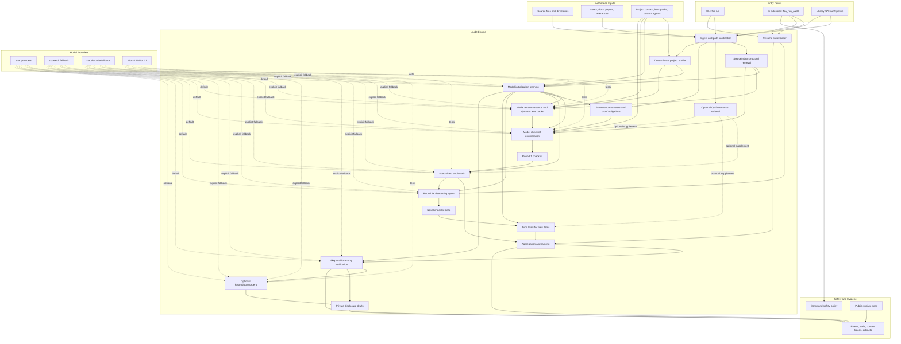

# Architecture

## Boundary

`full-stack-auditor` has two layers:

- Audit engine: deterministic TypeScript modules under `src/ingest`, `src/index`, `src/profile`, `src/learn`, `src/lens`, `src/seeders`, `src/audit`, `src/verify`, and `src/reports`.
- Pi integration: thin adapters under `src/llm/pi-ai.ts` and `src/pi/extension.ts`.
- Optional local fallbacks: `src/llm/codex-cli.ts` for authenticated Codex CLI environments and `src/llm/claude-code.ts` for authenticated Claude Code environments. These fallbacks do not route through pi-ai.

The audit engine should not depend on pi-coding-agent. This keeps batch runs, CI, web UI, RPC mode, and future coding-agent flows on the same underlying artifacts.

## Pipeline



```text
source + corpus
  -> ingest
  -> source index / optional QMD retrieval
  -> deterministic project profile
  -> model initialization learning notes
  -> proof-obligation extraction / provenance adapters
  -> model project reconnaissance / dynamic lens packs
  -> optional local checklist seeders
  -> retrieval-traced LLM enumeration
  -> round 1 checklist
  -> specialized audit trials
  -> round 2+ model deepening / novel checklist delta
  -> specialized audit trials for new items
  -> aggregation
  -> independent verification plan
  -> optional local-only reproduction plan or execution
  -> disclosure draft
```

Project profile, source index, initialization learning notes, proof obligations, provenance graphs, dynamic lens packs, and optional local checklist seeders are planning and context mechanisms. They may propose audit questions and routing guidance, but they must not produce bug findings. Findings come only from model-backed audit trials.

`AuditorConfig.projectLearning` controls the model initialization stage. It is enabled by default for live runs and writes `project_learning.json`, a reviewable record of what the model learned from the loaded source, corpus, deterministic profile, and configured high-level scope before it proposes lenses or checklist items.

`AuditorConfig.localChecklistSeeders` controls whether deterministic seeders contribute checklist items. They are disabled by default and should be enabled only for dry-run coverage inspection or local regression tests. Source-discovery proof runs should leave them disabled so both checklist enumeration and audit findings come from model calls.

## Rounds vs Trials

The framework has two different repetition mechanisms:

- `rounds`: project exploration depth. Round 1 creates the initial checklist. Round 2 and later call a deepening agent that reads prior checklist coverage, audit observations, and ranked findings, then proposes only novel follow-up items.
- `trials`: per-item stochastic coverage. Each trial audits the same item independently so aggregation can use hit rate and confidence instead of trusting one sample.

This distinction is important. A stronger run should not merely repeat the same checklist. Later rounds must add new `(location, security property, failure mode)` coverage, and the pipeline rejects duplicates using the same normalized item key for all rounds. If a deepening round produces no new items, the run records the no-op and stops instead of replaying prior items.

The deepening stage is still a planning stage. It does not produce findings. It only expands the checklist with source-grounded questions for later audit agents.

`--resume-run <dir>` and `--resume-last` append additional rounds to an existing run. Resume mode loads prior `checklist.json`, `audit_results.json`, `lens_packs.json`, and `project_learning.json`, then starts at the next round number. If a run fails before writing cumulative `audit_results.json`, resume falls back to completed `round_<n>_audit_results.json` artifacts. If a failed run already produced `round_<n>_deepening_items.json` for the next incomplete round, resume audits those pending items instead of spending another model call to regenerate them. In normal mode, `--rounds <n>` means "run n total rounds from scratch"; in resume mode, `--rounds <n>` means "append n more rounds."

The deepening strategy is explicit:

- `breadth`: bounded breadth expansion across new modules, trust boundaries, invariants, and unexamined data-flow edges.
- `depth`: bounded depth expansion around top candidates and skeptical observations. It produces follow-up audit items that can confirm, refute, or narrow hypotheses through source tracing, caller/callee dominance checks, counterexample conditions, and local verification obligations.
- `hybrid`: the default. The planner splits each later-round item budget across breadth and depth branches, then deduplicates the combined item set. If prior findings exist, depth receives about half the budget. If no findings exist, breadth receives most of the budget while depth still gets a smaller near-miss analysis slice when enough budget is available.

This makes the default policy a beam-search style audit: keep expanding coverage while preserving a scored queue of promising hypotheses for deeper scrutiny. It avoids two failure modes: pure breadth that never proves anything deeply, and pure depth that overfits early false positives.

Near-miss analysis is a planning heuristic, not a detector. It queues no-findings that established only a local invariant, selector edge, caller/callee boundary, or adjacent flow, then asks the next planner to inspect the next source-backed edge. The model still has to produce and audit a novel checklist item before a finding exists.

## Agent Roles

- ProjectLearningAgent: reads loaded source and reference material, then writes source-backed planning notes without claiming vulnerabilities.
- LensDiscoveryAgent: reads the loaded project context and proposes dynamic lens packs for the target's assets, trust boundaries, invariants, attacker capabilities, and domain-specific failure modes.
- Enumerator: maps code locations, spec statements, security properties, and failure modes.
- DeepeningAgent: reads prior coverage and audit observations, then proposes novel follow-up checklist items for later rounds.
- MissingConstraintAuditor: checks whether a relied-on security property has a visible enforcement edge.
- BalanceIntegrityAuditor: checks conservation and turnstile boundaries.
- NullifierAuditor: checks uniqueness of spend markers and replay resistance.
- SpecMismatchAuditor: compares implementation and written spec line by line.
- ConsensusAuditor: checks ambiguity that could split implementations.
- VerificationAgent: refutes or confirms findings and writes local-only test scaffolds.
- ReproductionAgent: optionally writes a minimal local-only reproduction plan, creates tests in a copied workspace, and executes bounded local test commands when explicitly enabled.

Audit roles are declared in `src/agents/registry.ts`. Adding a new role should be a registry change plus tests and, when useful, a local checklist seeder.

The registry is extensible at runtime. `AuditorConfig.auditorAgents` accepts additional agent definitions, and their failure modes are merged into the enumeration prompt through `effectiveFailureModes`. The audit runner builds an agent registry for each run, so custom checklist items can route to custom guidance without changing built-in agents.

Project-specific customization has two layers:

- `projectContext`: human- or config-provided assets, attacker capabilities, trust boundaries, invariants, focus areas, and out-of-scope notes.
- `lensPacks`: scenario-specific failure modes, enumeration guidance, audit guidance, and optional auditor agents.

Live runs enable `projectLearning` and `dynamicLensDiscovery` by default. Project learning writes `project_learning.json`; lens discovery writes `lens_packs.json`. Both are normalized, bounded, reviewable planning artifacts, not findings.

## Proof Obligations and Provenance

The initialization path now extracts `proof_obligations.json` from loaded corpus, source text, model learning notes, and supported provenance adapters. Obligations are short source-backed properties that enumeration should turn into concrete audit items when visible implementation evidence exists. They are intentionally not vulnerability findings.

Supported provenance adapters emit machine-readable facts about how security-relevant values move through a framework or DSL. The current Halo2 adapter writes `halo2_provenance_graph.json` with advice assignments, advice copies, equality constraints, equality-enabled columns, gate creation, gate queries, and selectors. This makes assignment and enforcement edges visible to the model even when a large source overview would otherwise truncate the relevant lines.

The adapter does not encode "this is a bug" rules. It only creates attention-routing facts and generic assignment-flow obligations. The model must still enumerate a concrete source-backed audit item, the audit stage must reason over the retrieved code, and verification must confirm or refute the candidate locally.

## Context Retrieval Quality

Audit prompts are intentionally bounded, so recall quality is part of audit correctness. The retrieval layer has two tiers:

- Deterministic `SourceIndex` retrieval is always enabled. It includes exact `file:line` ranges, semicolon-separated multi-file ranges, nearby source windows, same-file structural context, and referenced helper definitions found in the direct context.
- Optional `source-index+qmd` retrieval asks a locally installed QMD index for semantic matches and maps returned paths back to the already ingested source documents. QMD augments structural retrieval; it does not replace direct location or call-reference slices. Runs can pass `qmdCollections` or `--qmd-collection` to keep retrieval scoped to the target repository or corpus collection; this improves recall quality and avoids unrelated local collections.

Enumeration writes `round_<n>_enumeration_context_retrieval.json` before the model produces the checklist. The selected source slices come from proof-obligation references, provenance facts, and optional QMD probes, then the remaining budget is used for a broad source overview. This is designed to prevent important late-file or cross-file assignment and ingress edges from being dropped before the model has a chance to enumerate them.

Every non-dry audit round writes `round_<n>_context_retrieval.json`. Each entry records the item id, retrieval mode, included slices, line ranges, reasons, budgets, truncation status, QMD collection scope, and QMD availability or hit metadata. These traces are first-class debugging artifacts: if a model returns "needs more context", the next engineering step is to inspect whether the trace omitted the requested implementation, trait, constructor, test, or spec section.

Retrieval is not discovery evidence. It can only provide context to model-backed audit trials. A finding must still come from a model trial grounded in the retrieved source.

## Local Seeder Regression Gate

`npm run check:blind-discovery` runs the framework against a neutral fixture. The fixture does not name a target protocol, impact, or expected bug. The gate passes only if local checklist generation produces a generic missing-constraint audit item from source structure alone.

This legacy-named command is not a substitute for model discovery. Local checklist seeders prepare optional coverage; only model-backed learning, enumeration, and audit trials count as autonomous bug-discovery evidence.

## Pi Integration

The project is a pi package. `package.json` exposes:

- `src/pi/extension.ts` as an extension with audit tools.
- `skills/whitehat-auditor/SKILL.md` as operating instructions.
- `prompts/audit-target.md` as a reusable prompt template.

The extension registers read-only audit tools first. Tools that write tests or run commands should stay behind explicit user confirmation and sandbox guards.

`fsa_run_audit` defaults to dry-run so package users can inspect checklist generation before spending model calls. The extension also installs a guardrail on bash tool calls and direct user bash commands that combine public live networks with exploit/broadcast wording.

The command guardrail lives in `src/security/policy.ts` so non-pi integrations can reuse and test the same policy.

Model calls should use pi-ai providers by default. `provider=codex-cli` and `provider=claude-code` are explicit local CLI fallbacks for validation runs and should not replace pi package integration. The Claude Code fallback invokes Claude Code directly; it does not call Claude through pi. CLI fallbacks run in temporary non-interactive contexts with tool access disabled where supported. Individual provider failures are recorded as trial-level model errors so the run can finish and be resumed.

## Runnable Gates

- `npm run check`: strict TypeScript compile.
- `npm test`: build plus Node tests for JSON parsing, seeders, dry-run pipeline, mock end-to-end pipeline, and pi extension registration.
- `npm run dry-run`: local checklist seeder run against fixtures. It must produce zero findings.
- `npm run mock-run`: full model-shaped pipeline using deterministic mock LLM.
- `npm run check:blind-discovery`: local seeder regression for checklist enumeration.
- `npm run check:source-discovery -- --source <path>`: opt-in live model assertion that disables local checklist seeders by default, requires initialization learning, enumeration, and audit model calls, and requires a model-produced finding without committing that source.

Use `--rounds <n>` with the source-discovery gate when evaluating iterative deepening. Round artifacts must show that later coverage came from `deepen_round_<n>` model calls and survived duplicate filtering.

Use `--expect-location-line <n>` with `--expect-location-file-regex <regex>` when the oracle should accept a broader model-produced source range that contains the target line. Use `--run-dir <path>` to re-check an existing live run artifact without making new model calls.

## Local-Only Verification

Verification code must default to a local-only ladder:

1. Unit test against the isolated gadget/function.
2. Component test against the local protocol implementation.
3. End-to-end local regtest/devnet/forked-node test.

It must not generate or run live-network exploitation flows.

Findings carry a confirmation status:

- `suspected`: at least one model-backed audit trial reported a candidate.
- `confirmed-source`: the independent verifier confirmed the source reasoning.
- `confirmed-executable`: an optional local reproduction command matched its expected result.

`AuditorConfig.reproductionMode` defaults to `off`, so normal hunting runs do not write PoC tests or run target project commands. `plan` asks the ReproductionAgent for a structured local-only plan. `execute` copies the configured source roots into `reproduction/<finding-id>/workspace`, writes only relative-path test files inside that workspace, and runs structured local test commands with the shared command-safety policy.

The CLI also exposes `fsa reproduce --run <dir> --source <paths...> --repro plan|execute` so PoC work can be batched after all potential bugs are found. This command reuses `summary.json`, `verifications.json`, and the same ReproductionAgent runner, then updates reports and confirmation status.
