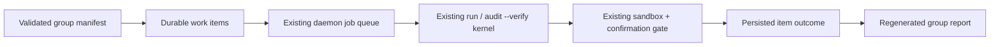
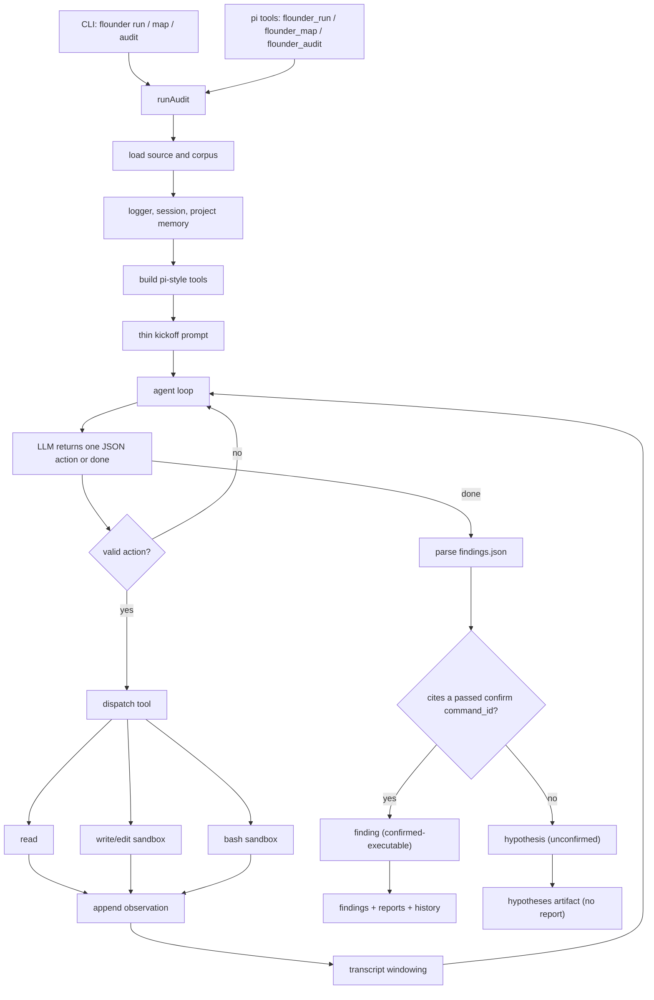
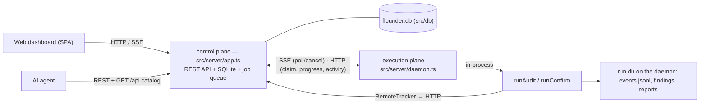

# Architecture

## Boundary

`flounder` is centered on the thin agentic audit path. The public driver is `flounder run`: with a clue it orchestrates prepare -> sealed map/dig/synthesize/verify -> confirm -> report; with explicit `--source` it runs the sealed map/dig/synthesize/verify audit directly. The model decides the audit strategy and the framework supplies only capabilities, safety, confirmation gates, and replayable state. The open-world counterpart, **`flounder confirm`** (`src/agent/confirm.ts`), takes a finished run's findings and reproduces them against real-world ground truth with the network available (see [Open-World Confirmation](#open-world-confirmation-flounder-confirm)).

The main layers are:

- Agent loop: `src/agent/loop.ts`, `src/agent/prompts.ts`, and `src/agent/audit.ts`.
- Agent tools: `src/agent/tools.ts` for pi-style read/write/edit/bash capabilities.
- Ingestion: `src/ingest/source.ts` loads authorized source and corpus material with public-safe paths.
- Safety: `src/security/policy.ts` and `src/security/sandbox.ts` gate local command execution.
- Reporting and history: `src/reports`, `src/trace`, and `src/agent/memory.ts`.
- Provider adapters: `src/llm/pi-ai.ts`, with explicit local CLI fallbacks in `src/llm/codex-cli.ts` and `src/llm/claude-code.ts`.
- Pi integration: `src/pi/extension.ts` registers workflow tools for `prepare`, `run`, `map`, `audit`, and `confirm`, plus the shell guardrail.
- Tracking store: `src/db/store.ts` records every run's metadata to SQLite (see [Tracking, API, and UI](#tracking-api-and-ui)).
- Evaluation control plane: `src/evaluation/contracts.ts` validates run-group manifests, material policy, capability-surface context, and evidence contracts; `src/evaluation/run-groups.ts` maps work items onto the existing audit kernel and scores only persisted evidence; `src/evaluation/harness-experiments.ts` mines verifier-grounded failures and compares bounded baseline/candidate variants without owning the promotion boundary.
- Server / UI: `src/server/` (control-plane REST API `app.ts` + execution-plane `daemon.ts` + web dashboard).

## Product Model

Flounder is an autonomous white-hat security auditor, not a framework-specific scanner. The product boundary is the audit workflow: prepare an authorized target, map the audit surface, dig selected scopes with local proof, and confirm reproduced findings against real-world ground truth. The model owns the audit strategy; the framework owns the capabilities and guarantees that make the result usable.

The default path must stay stack-agnostic. Source code, project docs, optional profiles, and prior runs are inputs the model can inspect. They must not become framework-side bug rules, schedules, or conclusions. The framework should add only:

- affordances the model cannot provide alone: source/corpus loading, sandboxed read/write/edit/bash tools, provider sessions, daemon execution, live activity, and reports;
- guarantees the model cannot self-enforce: command safety, local isolation, path redaction, durable replay, execution confirmation, refutation, confirm provenance, and white-hat no-broadcast policy.

Engagement modes are part of the product model, not the audit strategy.
`standard`, `bug-bounty`, and `bug-bounty-contest` tell the control plane which
workflow gates matter: normal bounty work keeps real-target confirmation and
payout-readiness checks in the path when a live target exists, while contest
work can prioritize short verify/report batches, skip real-target confirmation
when the venue is source-only, and append-map novel scopes without losing prior
coverage or duplicate/submission state.

## Evaluation and harness-improvement boundary

Run groups are an outer control-plane loop, not a second agent runtime. A group
contains independently resumable work items for benchmark cases, blind audits,
claim verification, replay, or multi-target campaigns. The scheduler uses the
existing SQLite job queue and daemon protocol:

The lifecycle axis (`queued`, `claimed`, `running`, terminal) is deliberately
separate from the evidence axis (`confirmed`, `refuted`, `no_findings`,
`blocked`, and so on). A build or daemon failure therefore cannot become a safe
control pass. Group concurrency counts queued daemon jobs as occupied slots,
and terminal item reconciliation plus next-item dispatch run again after a
control-plane restart.

Evaluation execution has explicit provenance. Each work item records its run in a
hidden `origin=evaluation` tracking project keyed by the durable work-item UUID,
while the audit kernel still uses the target bundle's target name for artifacts
and reasoning context. Normal project lists and Findings queries default to
`origin/source=project`; evaluation evidence is available only through an
explicit filter and links back to its run group. The shared queue claims normal
Project jobs before queued Evaluation jobs, preserving FIFO inside each class;
already-running jobs are not preempted.

Every dispatch also appends a `work_item_attempt` row. Retrying is limited to
blocked failed/cancelled items and resets only the current item projection; the
prior job, run, outcome, and diagnostic remain immutable attempt history.
Scored controls require a complete healthy run, and positive evidence that asks
for independent refutation cannot pass with a missing or errored refutation
stage.

Corpus visibility is fail-closed: every corpus path needs an explicit material
decision, duplicate or undeclared inclusions are rejected, and `warning` cannot
dispatch until an operator resolves it. Blind scored items also reject
free-form scope notes; structured capability-surface context is the narrow
model-visible alternative.

The editable/evolvable surface stops outside the trusted computing boundary.
Manifests may select authorized materials, model settings, repeated cases, and
evidence requirements, but they cannot execute their own commands, enable host
execution, relax network policy, bypass allowed sandbox backends, or mint
findings. Harness experiments use persisted baseline results to cluster terminal
verifier causes, record passing behavior that must be preserved, and propose
changes only inside an explicit file allowlist. The evaluator, expected answers,
command policy, material boundary, confirmation/refutation gate, promotion
policy, merge, and deployment authority remain outside the optimization loop.

```mermaid
flowchart LR
  BASE["Finished baseline Evaluation"] --> MINE["Verifier-grounded failure mining"]
  MINE --> PROPOSAL["Bounded candidate brief"]
  PROPOSAL --> CANDIDATE["Reviewable candidate branch / daemon"]
  CANDIDATE --> PAIR["Paired candidate Evaluation"]
  PAIR --> SCORE["Deterministic promotion gate"]
  SCORE --> DECISION["Promote / reject / more samples"]
  DECISION --> HUMAN["Human review, CI, merge, release"]
```

## Audit Flow

The diagram below is the **inner per-session loop** — one agent session. The default `flounder run` wraps it in a **map → dig** orchestration (and `flounder confirm` runs it open-world); that orchestration, plus the resumable scope inventory, is described under [Audit Modes](#audit-modes).

Dig and Verify share the same execution gate but have different inputs. Dig owns
discovery for one scope and tries to prove a new claim immediately. Verify owns
no discovery coverage: it receives unresolved Dig output, cross-scope synthesis
output, or an imported claim, then gives each claim an isolated confirm-or-refute
session. A pipeline Continue resumes an interrupted Dig batch first; otherwise,
when only evidence-tail work remains, it skips the empty audit setup and starts
at Verify/Confirm/Report. New verification runs persist as `kind=verify`; readers
still recognize the historical `kind=audit` plus `budgets.verify=true` encoding.

The loop has one protocol: the model emits exactly one JSON tool action per turn, or a `done` object after writing `findings.json`. The framework parses it, runs the requested tool, appends the observation, and calls the model again until the agent finishes or the step budget is exhausted.

## Audit Modes

The same loop runs several postures, selected by the CLI verb (`src/cli.ts` `applyAuditPosture`). All share the tools, the confirmation gate, and the white-hat boundary; they differ only in the prompt and (for map → dig) the orchestration around the loop.

- **Breadth** (`flounder run --quick`): one agentic pass. The model decides what to read, suspect, and test. Good for triage; not the default.
- **Deep, pinned** (`flounder audit <region>`): skip enumeration and deep-audit one region the operator names, obligation by obligation ("name the enforcing line or the missing edge"; "looks standard"/"matches upstream" never clears).
- **Map → Dig** (`flounder run`, the default real audit; or `flounder map` then `flounder audit`): two phases.
  - **MAP** (`map` role): a bounded breadth pass whose only job is to enumerate a *complete* scope inventory to `scopes.json`. The model applies three general lenses — spec conditions, value/asset flow, trusted-but-unbound inputs — and scores each scope by exposure × difficulty. The framework encodes **no** domain analysis: the lenses are prompt text, the model reads the code and writes the inventory, and `readScratchScopes` only parses the JSON the model produced. Scoring is the model's; the framework's sole ranking act is `sort(by model score)` then `slice(maxScopes)`.
  - **DIG** (`dig` role): deep-audits the selected scopes one at a time via the pinned-deep posture, each pinned to a scope's obligation + region. Findings are accumulated and tagged with their `scopeId`.

**Resumable coverage.** The scope inventory persists (with per-scope status) under the project history dir (`scope-store.ts`), next to `memory.jsonl`. A map → dig run audits the highest-scored *not-yet-audited* scopes up to `--max-scopes`; the rest stay `pending` (visible, never silently dropped). Re-running `flounder run` (or `flounder audit` against the inventory) **resumes** — it skips MAP and audits the next batch — so a large inventory reaches full coverage across several budget-limited runs. `flounder map` enumerates without digging; `--remap` re-enumerates from scratch. `AuditRunResult.scopeCoverage` and a CLI hint report progress. The inventory is **checkpointed right after the MAP phase and after EACH dig** (status, plus the run dir's partial `audit_findings.json` on the sequential path). In-process writers are serialized and each snapshot is flushed to a mode-0600 temporary file, atomically renamed, and directory-synced where the platform supports it; corrupt/incomplete checkpoints fail visibly instead of being mistaken for an empty map. A run KILLED mid-way therefore resumes by skipping MAP and the already-audited scopes and redoing only the one in-flight dig. Concurrent dig workspaces use a normalized scope id plus a stable hash suffix, so different ids cannot collide after path sanitization. (`flounder confirm` likewise checkpoints its decision sheet to the run dir each turn, so an interrupted reproduction keeps the rows done so far.)

**Human-in-the-loop seam.** `flounder audit --scope <id[,id...]>` deep-audits exactly the named inventory scopes (re-auditing an already-audited one is allowed), ignoring score order — the operator picks from the complete map by id, reusing the obligation + region the map already wrote. This is the reliable path when the model's *ranking* under-orders a subtle-but-critical scope: enumeration is complete, so the scope is always pickable even if it ranks low.

**Per-role models.** `map`/`dig`/`refute`/`default` each resolve a provider/model/thinking via `resolveRole` (role entry → `default` → top-level config); nothing is auto-downgraded. This spends the expensive model where it matters and lets the provider be switched in one line (the driver — continuous pi session vs per-step loop — is auto-selected from the resolved provider). See `examples/models.*.json`.

## Thin-Layer Rule

A component belongs in audit mode only if it gives the model something it cannot provide for itself:

- an affordance: read source, write/edit a copied workspace, inspect with local commands, run a local test;
- a guarantee: sandbox isolation, command safety, path redaction, replayable logs, durable history, executable-confirmation gating.

A component does not belong in the default audit path if it tells the model what bug class to look for, what schedule to follow, or what conclusion to reach. If a human prior is still useful, expose it as an optional model-callable tool.

## Tool Surface

Default tools:

- `read`: read loaded source/corpus or files created in the sandbox.
- `write`: write bounded files into the copied sandbox workspace.
- `edit`: replace text in a file inside the copied sandbox workspace.
- `bash`: run one policy-gated local command in the copied workspace. `purpose=inspect` (default) is for exploration (`ls`/`find`/`rg`/`cat`/`sed`/reads) and never confirms anything; `purpose=confirm` must be a real local test/build runner (`cargo test`, `forge test`, `go test`, `node --test`, `pytest`, …) with success patterns, and only it can mint confirmation.

There are no default bug-class, dataflow, checklist, memory, or report tools. Optional priors should live as extension skills, prompt packs, corpus material, or package add-ons, not as default strategy in audit mode.

## Confirmation Boundary

The hard rule is that the model cannot confirm a bug by assertion. The problem is that the model otherwise controls all three of: the code under test, the test, and the success criterion. Three mechanisms take that control away.

**Status ladder** (`ConfirmationStatus`):

- A **hypothesis** (`suspected`) is any candidate not backed by a passing test. Recorded prominently in `audit_hypotheses.json` and counted in `summary.coverage.hypotheses`, but it is not a finding and gets no report.
- `confirmed-executable` — cited a `bash` `command_id` of a `purpose=confirm` run that passed (expected exit plus every declared success pattern).
- `confirmed-differential` — the strongest: also survived fail-after-fix (below). `confirmed-*` candidates are findings: they enter `audit_findings.json`/`summary.findings` and get a disclosure report.

**1. Confirmation requires a real test/build runner.** An inspection command (`cat`, `rg`, …) can never mint confirmation even with `purpose=confirm` and a matching success pattern — otherwise a model could forge proof by printing a success string from a file it wrote itself (`isAgentConfirmCommand` in `src/security/policy.ts`).

**2. Baseline integrity.** Right after the target source is copied, the framework records the pristine file set (`listWorkspaceFiles`, before corpus/warm-up/any model action) on the session. `write`/`edit` reject any path in that baseline — the model may only add new test files. So a test runs against code the model cannot have weakened to make its own exploit pass.

**3. Differential confirmation (fail-after-fix, `src/agent/differential.ts`).** A passing exploit test only proves the test passes. For `confirmed-differential`, a finding also supplies `fix_patch` ({path, old, new}, an edit to a *target-source* file) and `patched_success_patterns`. The framework — not the model, which cannot touch target source — applies the fix to the pristine source, re-runs the *same* cited test, then restores the source. It confirms only when the exploit reproduced on the baseline AND, after the fix, the test still compiles/runs, the blocked-exploit signal appears, and the exploit no longer reproduces. A tautological test behaves identically before and after the fix, so it cannot reach `confirmed-differential`; a fix that merely breaks the build fails the "still runs" check.

`bash` routes through `src/security/sandbox.ts` and the command-safety policy. Sealed audit commands stay local-only: source inspection, unit tests, fixtures, local regtest/devnet, forked local nodes, or isolated harnesses. Open-world commands get egress only through the explicit capability classifier described below. Public network broadcast, transfer, credential use, persistence, exploit optimization, destructive commands, and paths outside the copied workspace are blocked.

The execution backend is explicit. `AuditorConfig.sandboxBackend` defaults to `auto`, which prefers Apple's `container` runtime on Apple silicon macOS when the selected image and sealed network are ready, then falls back to the Docker-backed OCI image `flounder-sandbox:latest` when it is available, and otherwise returns a policy failure instead of silently running model-generated code on the host. The default OCI runner is Docker-backed (`docker image inspect` / `docker run`), so real execution-confirming audits on non-Apple-container hosts need Docker, or a Docker-compatible CLI/daemon, plus a built or pulled sandbox image. `--sandbox-backend oci` requires that Docker-backed path. `--sandbox-backend apple-container` requires Apple's `container image inspect` / `container run` path and the selected sandbox image in the Apple container runtime. `--sandbox-backend host --allow-host-execution` is a trusted-local escape hatch for deterministic fixtures and development smoke tests; it preserves the isolated `HOME`, `TMPDIR`, and package-cache environment, but it is not treated as kernel isolation and should not be used for untrusted targets. The Docker-backed OCI runner bind-mounts only the copied workspace (and the optional persistent package cache), disables image pulling at execution time, drops Linux capabilities, sets `no-new-privileges`, uses a read-only root filesystem with tmpfs temp dirs, applies pids/memory/CPU limits when configured, and uses Docker's `--network none` for sealed inspect/confirm commands. The Apple container backend maps the same workspace/cache/env/resource/read-only/capability/tmpfs controls through `container run`; for sealed commands it creates or reuses an internal host-only, no-DNS `flounder-sealed` network.

`flounder-sandbox:latest` is a baseline toolchain image, not a universal audit environment. Specialized targets should supply a target-specific image through `--sandbox-image` or the daemon launch spec. The repository includes reviewed recipes for common ecosystems such as `flounder-sandbox:cairo` (Scarb + Starknet Foundry) and `flounder-sandbox:ton` (TON Blueprint + FunC/Tolk/Tact tooling), but those are still verification-environment support, not audit strategy. Image construction is part of the trusted execution base: the audit model may produce a missing-tool diagnosis or a reviewable image recipe, but arbitrary `docker build` / `docker pull` is not exposed as a sandboxed audit tool. A future automated image builder should live outside the model-directed audit loop as a controlled prepare step: locked templates, pinned base images, explicit review policy, image digest recording, and no direct access to host credentials.

## Verification Environment

Confirmation is only reachable if the model's local test can compile and run, which on a real target requires the toolchain's dependencies. Two settings make a heavy compiled target workable. First, `--build-root` decouples the buildable workspace from the audit scope: the sandbox copies the build root (e.g. a Cargo workspace whose members the audited crate path-depends on) so the project compiles, while the model still reads only `--source`. Second, `src/agent/prepare.ts` warms the copied workspace once: it detects the toolchain (Cargo, Go, npm/pnpm/yarn, Scarb/Cairo, TON Blueprint, Foundry) and runs the project's own dependency fetch/build (`cargo fetch` + `cargo build`, `go mod download`, `npm ci`, `scarb fetch` + `scarb build`, `blueprint build --all`, `forge build`, …) with network allowed and a generous timeout (`AuditorConfig.auditPrepareTimeoutMs`). The warm-up uses a **persistent package cache** (`HOME` is the per-run workspace; `CARGO_HOME`/`SCARB_CACHE`/`GOMODCACHE`/npm cache live under the project history dir, shared with the model's own commands), so dependencies download once and the heavy dependency build is reused. In OCI or Apple container mode, only that cache directory is mounted into the container; host credentials/config are not exposed to the executed command. It builds the lib/deps (not the model's in-progress scratch tests) so confirmation runs are incremental. Afterwards the model's `bash` build/test runs are incremental — and build/test commands (`isAgentBuildCommand`/`isAgentConfirmCommand`) get the build-grade timeout (`max(reproductionCommandTimeoutMs, auditPrepareTimeoutMs)`), not the short inspect budget, so a real native test can compile and run within budget. These commands are framework-chosen (not model input); the step is gated by `AuditorConfig.auditPrepare` (default on, `--no-prepare` to skip) and is a no-op when no supported manifest is present.

This path is validated end-to-end: with `--build-root` set to a Cargo workspace and a generous `--prepare-timeout-ms`, the codex provider autonomously found a real crate-internal ZK soundness bug, authored a MockProver exploit, built and ran it, and the finding reached `confirmed-differential` (the framework applied the model's fix to pristine source and re-ran to show the exploit blocked). The codex provider (via pi) is the launchable autonomous path and routes all tools through this sandbox.

Warm-up is **lazy**: the `bash` tool runs it once, on the first test/build command (`isAgentConfirmCommand`), rather than eagerly before the loop. So a read-only audit, or a run that fails authentication before it ever runs a test, pays nothing for it.

Prepare failures become product-owned resource blockers. Failed pinned tool
checks and failed warm-up commands are converted into normalized
`resource-request` rows with a short diagnostic and retry command, independent
of whether the model authored `resource_requests.json`. This keeps
`needs-resource` grounded in execution signals and gives the UI/API a concrete
backlog item for missing toolchains, broken sandbox images, dependency setup,
fork setup, credentials, or other environment blockers.

Reference-independence is why execution-grounding is the core of confirmation, not a nicety. A reference implementation, spec, book, or prior audit can carry the same bug — some bugs live in the canonical implementation itself — so "matches upstream/spec" inherits the reference's errors and cannot, in principle, catch a bug present in the reference. Only two things are trustworthy because neither depends on an external authority being correct: the security property derived from first principles, and an executable counterexample that the real artifact accepts. The audit prompts therefore forbid comparison-based clearing (a component is cleared only by naming the invariant and the constraint that enforces it, or by an executable counterexample), and differential confirmation is the framework-side instance of the second anchor.

**Independent refutation** (`src/agent/refutation.ts`, gated by `AuditorConfig.auditRefute`, default on) guards against a single reasoning chain inheriting a wrong assumption. After confirmation, a fresh-context skeptic — which never saw the finder's investigation — re-derives the invariant and tries to break each confirmed finding (show the property is enforced, or the exploit does not work), under the same no-comparison-clearing rule. A single-test `confirmed-executable` it debunks is downgraded to a hypothesis; a `confirmed-differential` it disputes is kept (execution is ground truth) but flagged `disputed` in the finding and the disclosure report for human review. Verdicts are written to `audit_refutation.json`.

Remaining hardening targets: execution-driven discovery on a buildable target (adversarial property tests reveal under-constraint empirically, independent of any reference), optional stronger isolation backends for environments that require more than Docker/OCI, and turning `confirmed-differential` findings into stored regression tests that future runs re-execute.

## Open-World Confirmation (`flounder confirm`)

`flounder confirm <run-dir> --source <paths...>` (`src/agent/confirm.ts`, `runConfirm`) is the open-world counterpart to the sealed `run`. It does not discover; it takes confirmed findings to a real-world standard of certainty and emits a submit/no-submit decision sheet. It reuses the same session driver, sandbox, and confirmation gate as `run`; the capability difference is that explicit read/fork/fetch commands may receive network egress.

Confirm is **finding-grained and resumable.** The CLI form takes one run dir (all its confirmed findings); the dashboard/control-plane form works from finding **status**: `runConfirm` accepts `inputRunDirs[]` + `confirmKeys[]`, unions the confirmed findings across those run dirs (keyed by the shared content key), and keeps only the requested set — so a *project-level* confirm reproduces every still-pending finding (locating each one's source run dir via its `run_id`) and a *finding-level* confirm does just one. As each decision settles, the member findings' `confirm_status` flips (`reproduced` / `not-reproduced`); a re-run only picks up findings still NULL — that is the resume.

**Pipeline (one session):**

1. **Freeze + fingerprint.** Before any network access, `runConfirm` hashes the input run's `audit_report.md` / `audit_findings.json` / `report_*.md` (sha256 + timestamp) to `confirm_provenance.json`. This anchors the provenance claim that the findings were produced blind, independent of anything the open-world pass later reads online.
2. **Reproduce.** The frozen findings seed an open-world session. The model reproduces each against real ground truth — it decides what that is for the target (a mainnet fork of the deployed contract + its real verifier, a real released package, a real local node) and writes the reproduction itself. The session can request narrow read/fork/fetch egress, but its arbitrary programs remain network-sealed. No per-technology branches: the framework supplies capability + goals + an objective execution-grounded bar (real target, attacker-real capabilities, the effect exhibited as a concrete observable), and refuses to accept a row as `reproduced` unless it cites a passing `purpose=confirm` run that cleared that bar.
3. **Consolidate by execution** (`src/agent/consolidate.ts`). A fix-equivalence matrix cross-applies each reproduced bug's `fix_patch` to the pristine source and re-runs the others' PoCs (reusing `runDifferentialConfirmation`); two bugs are the same iff a single fix neutralizes both, in both directions. `unionFindClusters` turns the symmetric relation into clusters. Distinct bugs are decided by execution, not by similar titles — the framework's call, not the model's.
4. **Decide.** `confirm_decision.json` (one row per distinct bug: reproduced?, evidence, novelty/corroboration, `submit-candidate`/`needs-human`/`drop`), `confirm_report.md`, and `confirm_equivalence.json` (the matrix + clusters). For bounty-like engagements, reproduced rows also carry a framework-visible live exposure contract: the agent writes `impact_inventory.json` with affected deployments, live/funded status, sizing evidence, and blockers. The framework does not prescribe a platform, chain, or enumeration strategy; it only requires the evidence artifact before a bounty-like row can stay `submit-candidate`.

**Network policy.** `analyzeConfirmBashCommandSafety` (`src/security/policy.ts`) keeps structural and white-hat checks, while `openWorldCommandNeedsNetwork` decides the actual sandbox capability for each command. Only allowlisted read/fork/fetch shapes — read-only HTTP, explicit HTTPS Git operations, read-only GitHub/chain queries, and local-fork commands — receive egress. Other accepted commands run with `network=none`, and `FOUNDRY_FFI=false` prevents a fork test from spawning an unclassified helper process. A broadcast/submit verb (`cast send`, `forge script --broadcast`, `eth_sendRawTransaction`, …) remains blocked when its target is non-local, so replaying the exploit against a *local* fork is allowed while pushing it to a live network is not. Structural guards (plain program name, simple argv, workspace-contained paths) are unchanged.

**Budget.** Confirm is unbounded by default: `runConfirm` sets `auditMaxSteps` to a non-finite sentinel, and the session driver treats non-finite/≤0 as "no turn cap" (the run ends when the model emits done). Reproduction is heavy and a fixed step count silently truncates productive work; `--max-steps N` caps it only when asked. The confirm prompt pushes the model to reproduce early and own its own stop rather than survey indefinitely. Confirm requires a pi-session provider; the mock/CLI fallbacks cannot fork a live network.

**Resume.** Confirm auto-resumes an interrupted prior confirm of the same input run: `loadSettledFromPriorConfirm` finds the latest prior `<target>-confirm-*` run whose frozen provenance matches this input and returns its SETTLED rows (`reproduced` yes/no). Those are injected into the seed with a "carry verbatim, do not re-reproduce" instruction, the session driver checkpoints `confirm_decision.json` to the run dir each turn (so a hard kill keeps the rows done so far), and a safety net re-adds any settled row the model dropped. So a re-run reproduces only the un-settled findings. `--fresh` ignores prior progress. (The fix-equivalence matrix only spans the current session's PoCs; carried rows pass through as singletons.)

**Epistemics.** The same execution-grounding that makes `run`'s confirmation trustworthy is transposed to the open world: execution against the real target is the only truth; a web source is a lead and a novelty disqualifier, never proof; only attacker-real capabilities count. A finding that only reproduced under a substituted trusted component, an unreachable precondition, or assumed state is recorded `not-reproduced` with the exact crutch named — this is the execution-grounded version of the `run` refutation's faithfulness check, now run against the *real* component rather than a re-mocked one. For bounty-like work, payout readiness is evidence-grounded too: `enforceBountySubmitReadiness` keeps rows at `needs-human` if scope, live impact, known-issue, payout, or `impact_inventory.json` coverage is missing.

Validated end-to-end on a prior `run`'s Aztec findings: the real `numRealTransactions` accounting bug reproduced on a mainnet fork (real proxy + real verifier, flipping one attacker-controllable byte), while the verifier-false-return and short-return-proxy findings were execution-*refuted* (the real verifier reverts; the real proxy returns well-formed data) — 13 findings consolidated to 7 distinct, 1 reproduced, zero false reproductions.

## Memory And History

Each audit writes:

- `audit_transcript.json`: action/observation replay.
- `audit_findings.json`: execution-confirmed findings only.
- `audit_hypotheses.json`: unconfirmed candidates.
- `run_health.json`: framework-owned health classification (`healthy`, `needs-coverage`, `needs-resource`, `shallow`, or `infra-failed`) derived from objective run signals.
- `coverage_gaps.json`: model-owned coverage deltas for obligations or evidence paths that need a later map/dig pass.
- `resource_requests.json`: model-owned environment/tooling/artifact blockers that prevent deeper exploration or confirmation.
- `followup_scopes.json`: model-owned adjacent scope proposals; the framework persists accepted proposals as pending scope-inventory entries instead of spawning unbounded side quests.
- `audit_command_runs.json`: sandboxed local command records.
- `audit_prepare.json`: toolchain warm-up results (when a manifest was detected).
- `summary.json`: ranked summary (findings) with `coverage.hypotheses`.
- `report_<id>.md`: private disclosure drafts, for confirmed findings only.
- `events.jsonl` and `calls/*.json`: trace and model calls.

Each `flounder confirm` writes `confirm_provenance.json` (frozen findings' fingerprints), `confirm_decision.json` + `confirm_report.md` (the decision sheet), `confirm_equivalence.json` (the fix-equivalence matrix and clusters), optional `impact_inventory.json` for bounty-like live exposure evidence, and the usual `confirm_transcript.json` / `events.jsonl` / `calls/*.json` session trace.

Per-target memory lives at `<out>/history/<target>/memory.jsonl`. Audit surfaces recent memory at kickoff and automatically stores parsed findings for later runs.

The discovery backlog files are intentionally not findings and not a framework-owned search strategy. They are narrow affordances: the model records what it could not cover, what resource would unblock proof, or what adjacent scope should be audited later; the framework validates/parses them, saves them as artifacts, writes normalized project backlog rows to SQLite, classifies them for agent-owned actionability (`agent-runnable`, `agent-resource`, `agent-review`), surfaces counts through the stage funnel/API/dashboard, passes open rows into the next audit launch as project Next Actions, and keeps follow-up scopes pending for future coverage. A run should resolve or route open Next Actions before opening unrelated fresh coverage; the operator is asked only for explicit credentials, authorization, or unavailable external resources.

Project history lives under `<out>/history/<target>/manifest.json` and records sanitized run metadata, findings, and materials. Paths must stay repository-relative or placeholder-based in public-facing artifacts.

## Drivers

Audit has two interchangeable drivers behind the same tools, sandbox, confirmation gate, and artifacts:

- Continuous session (`src/agent/pi-session.ts`, default for real runs): a pi-coding-agent `AgentSession` owns the loop. The framework registers only the sandboxed tools as the session's `customTools` (with `noTools: "builtin"`, so pi's built-in filesystem tools are disabled while the custom sandboxed tools stay available) and calls `session.prompt()` once; the session keeps context server-side and orchestrates tool calls natively. This avoids the per-step transcript resend that grows quadratically and exhausts quota. The session is bounded by a turn budget (`AuditorConfig.auditMaxSteps`): on reaching it the framework counts `turn_end` events and calls `session.abort()`, so a real run cannot grow unbounded in cost. A non-finite/≤0 budget means **no turn cap** (the run ends only when the model emits done) — `flounder confirm` uses this by default, since reproduction is heavy and a fixed step count truncates productive work. Used whenever the provider is a real pi-ai provider.
- Legacy loop (`src/agent/loop.ts`): the framework re-drives a stateless `complete()` once per step with a JSON action protocol. Used for the deterministic mock (offline tests) and the explicit CLI fallbacks.

The default audit provider profile is `openai-codex · gpt-5.6-sol · xhigh`. The pinned pi runtime is `>=0.80.6`, the first project-supported line whose `openai-codex` catalog includes that model. A fresh store also seeds a `claude-code · opus 4.8 max` profile as an explicit local fallback option. Existing projects keep their selected provider profile; changing the starter default does not silently rewrite a project's runtime choice. The continuous session requires daemon-local provider auth configured through `flounder daemon provider login openai-codex`, imported from an existing pi auth entry in `~/.pi/agent/auth.json`, or supplied through daemon environment variables where the provider supports that. It does not reuse the standalone Codex CLI's credentials, so an unauthenticated run fails fast with an actionable Flounder command (use `--mock-llm` for offline checks). Per project constraint, the session driver targets pi-mono providers such as `openai-codex`; `claude-code` is not used as a session backend (it is not permitted outside Claude apps and needs no API key here).

## Provider Behavior

`provider=codex-cli` and `provider=claude-code` are explicit local CLI fallbacks that run through the legacy loop. CLI fallbacks run non-interactively and must preserve the audit contract: in agentic mode they must not inject "do not inspect files" instructions, because the framework tools are how the model investigates.

Model and provider selection stays runtime-configured. Do not assume every model family is available through every provider. In the dashboard, a **provider profile** is a reusable model strategy: provider id, default model, default thinking level, and optional role defaults. Credentials are not stored in the server; they live on each daemon via `flounder daemon provider login <provider>`, daemon environment variables, or the daemon's local secret manager.

A project selects one execution daemon and one default provider profile. It can also set `config.phaseProviders` for `prepare`, `map`, `dig`, and `confirm` when a phase needs a different provider profile. The selected daemon must authenticate every provider profile the project can use. `launchSpec` resolves the verb's primary phase into the run's top-level provider/model/thinking and maps map/dig/refute into role overrides, so a run can use different models for acquisition, enumeration, deep audit, refutation, and real-target confirmation without changing the audit kernel.

For blind benchmarks with `provider=codex-cli`, set `FLOUNDER_CODEX_WEB_SEARCH=disabled` to prevent public-report contamination. Real audits may leave Codex web search at its runtime default or set `FLOUNDER_CODEX_WEB_SEARCH=live/cached/disabled` explicitly.

## Pi Integration

The package extension exposes the agent-session workflow tools:

- `flounder_prepare`: open-world target acquisition from a clue.
- `flounder_run`: with a clue, the full prepare -> sealed map/dig/synthesize/verify -> confirm -> report pipeline; with source paths, the sealed map/dig/synthesize/verify source audit.
- `flounder_map`: sealed scope inventory only.
- `flounder_audit`: sealed dig from inventory, pinned region audit, selected scope audit, or inline finding verification.
- `flounder_confirm`: open-world reproduction pass over finished run findings.

The project-scoped report command is intentionally a CLI/API action rather than
a pi session tool: it depends on the tracking store's current material boundary,
finding eligibility, and existing report state.

The extension also installs the shared shell-command guardrail. The inner model tool surface remains the same sandboxed `read` / `write` / `edit` / `bash` tools; pi built-ins are disabled for the audit session so the model cannot bypass Flounder's sandbox or confirmation gate.

The command guardrail lives in `src/security/policy.ts` so non-pi integrations can reuse the same policy.

## Tracking, API, and UI

A second surface tracks and drives audits across projects. It is additive: the audit kernel is unchanged, and a run produces the same files whether launched from the CLI or this surface.

**Tracking store (`src/db/store.ts`, `record.ts`).** SQLite via `node:sqlite` (no dependency added) at `<out>/flounder.db`, WAL + busy-timeout so readers (the server) and writers coexist. The default `<out>` is `~/.flounder`, so normal installs keep the DB, run artifacts, durable history/build cache, daemon workspace, and provider auth under one product-owned home; system temp is used only for short-lived scratch. It is the **system of record for run tracking**, written live — not a rebuildable projection: projects, the run lifecycle, run-health verdicts, discovery backlog rows, scope coverage (mapped vs audited vs deferred, per-dig), findings and their status transitions (suspect→confirm→refute, on a `finding_status_event` timeline), and confirm decisions — plus a `daemon` registry (bearer tokens) and a `job` queue that is the control plane's dispatch record. Additive schema migrations run transactionally, add only explicitly declared columns, and surface unexpected SQLite failures instead of swallowing them. CI and release gates build a database with the latest prior ancestor `v*` tag's store, open it with the candidate store, and assert schema version, integrity, and representative data retention. It stores metadata + **paths** to the on-disk artifacts, not their content. Findings map the kernel `confirmationStatus`, with a skeptic-disputed finding surfaced as `refuted`.

Findings are persisted **incrementally** — as each scope's dig lands, then re-persisted as differential/refutation/appeal changes the verdict. `finding_key` remains the immutable key of the first occurrence; a project-scoped `canonical_key` from exact normalized title + location joins later exact occurrences without semantic-similarity guesses. `finding_occurrence` preserves every run/key/payload, and `finding_key_alias` resolves later Verify or Confirm keys back to the canonical row. `finding_phase_attempt` records Verify, Confirm, and Report input fingerprints, outcomes, blockers, and retry history. Each run also stores a content fingerprint of its readable source/build/corpus material, so unchanged blocked work stays ineligible until inputs change or an operator explicitly retries it. The additive migration collapses only exact legacy identities and keeps occurrence and alias provenance.

The remaining tracked axes include per-run `dig_started_at`, `run_scopes_*`, and `health_*`; per-scope `dig_seconds`, in-flight `auditing`, manual `priority`, `source`, and `parent_scope_id`; per-project discovery backlog rows; and per-finding `confirm_status` plus operator `tracking_status`. `ignored` findings remain recoverable but stay out of active confirm/report worklists.

**Control plane vs. execution plane.** Execution is **decoupled**. The server (control plane) owns the tracking store and the job queue but never runs an audit. One or more `flounder daemon start` processes (the execution plane, possibly on **other machines**) claim queued jobs and run `runAudit`/`runConfirm` locally — so the target **code and provider keys stay on the daemon**, never the server. The seam is `RunTracker`: `runAudit`/`runConfirm` accept `options.makeTracker`; the default `RunRecorder` (`src/db/record.ts`) writes the local SQLite store (the CLI path), while the daemon injects a `RemoteTracker` that **POSTs progress to the server** over HTTP instead of touching the tracking store directly. Every daemon mutation re-authenticates its bearer token and verifies that the referenced job/run is assigned to that daemon; a token cannot update another executor's progress, activity, pipeline worklist, or terminal status. `specToConfig(spec)` (`src/server/run-manager.ts`) maps a launch spec to an `AuditorConfig` (the equivalent of `parseConfig` + `applyAuditPosture`: posture per verb, unbounded budgets by default, remap/quick/region/scope/mock). Project and material paths are resolved beneath the daemon workspace and checked against their effective real paths, and a top-level source symlink is rejected before sandbox copying. Stop is cooperative: `POST /api/runs/:id/stop` flags the job for cancel and pushes an SSE nudge; the daemon aborts (`options.signal` → `session.abort()`, finalize → `killed`). `flounder ui` auto-spawns a co-located daemon unless `--no-daemon`; it reuses the local auto-daemon token so the daemon id is stable across UI restarts and project-pinned queued jobs remain claimable. A remote daemon authenticates with a token from `flounder server daemon-token mint`. Because runs live on the daemon, they **survive a server restart** — the server does not blind-kill `running` rows.

**REST API + self-describing catalog (`src/server/app.ts`).** A `node:http` server that binds to `127.0.0.1` by default. Every workflow operation is a REST resource so an AI agent can drive the whole flow without the UI: **project** (CRUD, including selected daemon, default provider profile, task/clue config, source/build/corpus paths, budgets, phase provider overrides, engagement config, archive/pin/manual order; project resource URLs use UUIDs, not names), **provider** (model strategy profiles), **daemon** (CRUD, token minting, rename, revoke), **run** (`POST /api/projects/:uuid/runs` **enqueues a job** and returns its `jobId`; `verb:"run"` is the automatic prepare-if-needed -> map/dig -> synthesize -> verify -> confirm -> report pipeline; contest projects first settle missing verify/report work, then open short batches and append-map when configured; open Next Actions are attached to the launch spec so the daemon can resolve or route them before opening unrelated fresh coverage; `GET /api/runs/:id`; `POST /api/runs/:id/stop`; `GET /api/runs/:id/artifact?name=` serves an allowlisted report or discovery-health artifact), **discovery-backlog** (`GET /api/projects/:uuid/backlog?kind=&status=` and `PATCH /api/backlog/:id`), and read-only **scope** / **finding** (paginated + filterable) / **confirm-decision**. Project detail embeds `latestRunHealth`, `backlogCounts`, open backlog rows, and open resource requests so the dashboard and agents do not scrape run directories. Backlog rows expose `actionability`, `action_owner`, `recommended_action`, and `primary_action_label`: agents advance coverage rows, resolve setup/resource rows when possible, route ambiguous rows to the right safe workflow action, and ask the operator only for explicit credentials, authorization, or unavailable external resources. Findings carry two operator axes: `PATCH /api/projects/:uuid/scopes/:id` with `{prioritize:true}` bumps a scope to the front of the dig queue, and `PATCH /api/findings/:id/tracking` advances a finding's operator state. **Confirm is finding-grained**: `POST …/runs` with `verb:"confirm"` and *no* run dir reproduces every still-pending confirmable finding (the control plane locates each one's source run dir from its `run_id` and passes the pending set); with `findingId`/`findingIds` it confirms selected findings; a re-run skips already-decided findings (resume by `confirm_status`). **Report is finding-grained** too: selected `findingIds` regenerate those reports, `regenerateReports:true` regenerates every current reportable finding, and an unselected report run generates only missing reports. The CLI commands `flounder continue --project <uuid|name>` and `flounder report --project <uuid|name>` drive the same project endpoints; `continue` posts `verb:"run"`, while report `--finding` sends selected `findingIds` and `--all` sends `regenerateReports:true`. A cross-project **`GET /api/bugs`** powers the Findings view by returning findings joined with project plus status/tracking aggregates; it supports project scoping (`project=<uuid>`) and `tracking=active` to hide ignored rows. `GET /api` returns a catalog of every endpoint (method, path, params, body, summary) — an agent fetches it once to learn the surface. The execution-plane protocol — `/api/daemon/*` (register, SSE stream, claim, run-start, progress PATCH, activity, job-status, pipeline worklists), each **bearer-token-authenticated** — is **hidden from the catalog** (it is machine-to-machine, not agent-facing). Routing is a data-driven table, so the catalog and the handlers cannot drift.

Finding reads are SQL-backed rather than loading a fixed in-memory window. `GET /api/findings/:id/lifecycle` returns one canonical finding's status timeline, occurrences, Verify/Confirm/Report attempts, and linked decisions; `POST /api/findings/:id/retry` reopens one blocked phase.

**Live streams.** `GET /api/stream` (SSE) pushes the project snapshot ~1/s (computed from aggregate queries, so it stays cheap with many findings). `GET /api/runs/:id/log` (SSE) streams a run's live **token-level** activity (thinking/output deltas + tool calls) from a per-run in-memory bus that the daemon feeds via batched activity POSTs, and `?format=json`/`?tail=N` also returns the durable `events.jsonl` tail so an agent can inspect terminal errors after the live stream is gone.

Run-group and work-item resources add durable create/start/pause/cancel/retry/report
operations to that same catalog. Harness-experiment resources add weakness mining,
bounded proposal refinement, candidate attachment, deterministic paired scoring,
and candidate-brief export. The Evaluations dashboard is a first-class client of
those resources and keeps work-item lifecycle separate from evidence verdicts and
experiment lifecycle separate from promotion decisions.

**UI (`src/server/ui`).** A React/Vite TypeScript app compiled into `dist/server/public` and served by the Node control plane. It is **one client of the API above** — it can be ignored entirely in favor of the API. Project detail shows the **prepare -> map -> dig -> synthesize -> verify -> confirm -> report** workflow, live activity, coverage, run health, Next Actions, scopes, findings, real-target outcomes, and reports. The cross-project **Findings** view uses SQL-backed filters and shows one compact current-phase/blocker summary per finding; the report detail expands the full evidence lifecycle and focused retry. **Evaluations** has two compact working modes: Runs operates durable run groups, evidence contracts, scoring, attempts, retries, and regenerated reports; Harness compares baseline/candidate metrics, mined failure patterns, bounded proposals, and promotion decisions. Evaluation evidence remains separate from disclosure tracking. **Settings** holds provider profiles, daemon CRUD, and archived projects. UI state derivation lives in `src/server/ui/src/domain.ts`, API types/client code live in `src/server/ui/src/api.ts`, and every action remains a single REST call.

## Runnable Gates

- `npm run check`: strict TypeScript compile.
- `npm test`: build plus Node tests.
- `npm run mock-audit`: deterministic offline audit smoke test.
- `npm run check:public`: fast public-surface scan for secrets and local paths in the current tree plus latest commit.
- `npm run verify`: full local gate.

## White-Hat Constraints

- Candidate projects and sealed local audits may use publicly available source code or explicitly authorized source code.
- Keep verification local-only.
- Never broadcast transactions or target public networks.
- Treat model output as untrusted input.
- Validate structured output and sanitize paths.
- Keep audit artifacts private by default.
