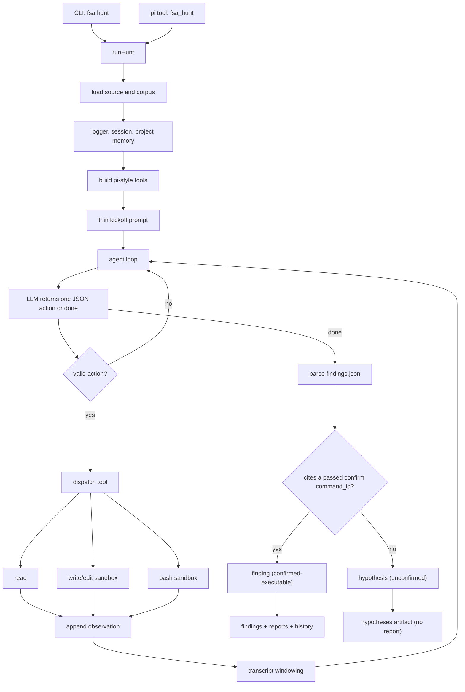

# Architecture

## Boundary

`full-stack-auditor` is now centered on the thin agentic hunt path. The public driver is `fsa hunt`; the model decides the audit strategy and the framework supplies only capabilities, safety, confirmation gates, and replayable state.

The main layers are:

- Agent loop: `src/agent/loop.ts`, `src/agent/prompts.ts`, and `src/agent/hunt.ts`.
- Agent tools: `src/agent/tools.ts` for pi-style read/write/edit/bash capabilities.
- Ingestion: `src/ingest/source.ts` loads authorized source and corpus material with public-safe paths.
- Safety: `src/security/policy.ts` and `src/security/sandbox.ts` gate local command execution.
- Reporting and history: `src/reports`, `src/trace`, and `src/agent/memory.ts`.
- Provider adapters: `src/llm/pi-ai.ts`, with explicit local CLI fallbacks in `src/llm/codex-cli.ts` and `src/llm/claude-code.ts`.
- Pi integration: `src/pi/extension.ts` registers the `fsa_hunt` tool and shell guardrail.

## Hunt Flow

The loop has one protocol: the model emits exactly one JSON tool action per turn, or a `done` object after writing `findings.json`. The framework parses it, runs the requested tool, appends the observation, and calls the model again until the agent finishes or the step budget is exhausted.

## Thin-Layer Rule

A component belongs in hunt mode only if it gives the model something it cannot provide for itself:

- an affordance: read source, write/edit a copied workspace, inspect with local commands, run a local test;
- a guarantee: sandbox isolation, command safety, path redaction, replayable logs, durable history, executable-confirmation gating.

A component does not belong in the default hunt path if it tells the model what bug class to look for, what schedule to follow, or what conclusion to reach. If a human prior is still useful, expose it as an optional model-callable tool.

## Tool Surface

Default tools:

- `read`: read loaded source/corpus or files created in the sandbox.
- `write`: write bounded files into the copied sandbox workspace.
- `edit`: replace text in a file inside the copied sandbox workspace.
- `bash`: run one policy-gated local command in the copied workspace. `purpose=inspect` (default) is for exploration (`ls`/`find`/`rg`/`cat`/`sed`/reads) and never confirms anything; `purpose=confirm` must be a real local test/build runner (`cargo test`, `forge test`, `go test`, `node --test`, `pytest`, …) with success patterns, and only it can mint confirmation.

There are no default bug-class, dataflow, checklist, memory, or report tools. Optional priors should live as extension skills, prompt packs, corpus material, or package add-ons, not as default strategy in hunt mode.

## Confirmation Boundary

The hard rule is that the model cannot confirm a bug by assertion. The problem is that the model otherwise controls all three of: the code under test, the test, and the success criterion. Three mechanisms take that control away.

**Status ladder** (`ConfirmationStatus`):

- A **hypothesis** (`suspected`) is any candidate not backed by a passing test. Recorded prominently in `hunt_hypotheses.json` and counted in `summary.coverage.hypotheses`, but it is not a finding and gets no report.
- `confirmed-executable` — cited a `bash` `command_id` of a `purpose=confirm` run that passed (expected exit plus every declared success pattern).
- `confirmed-differential` — the strongest: also survived fail-after-fix (below). `confirmed-*` candidates are findings: they enter `hunt_findings.json`/`summary.findings` and get a disclosure report.

**1. Confirmation requires a real test/build runner.** An inspection command (`cat`, `rg`, …) can never mint confirmation even with `purpose=confirm` and a matching success pattern — otherwise a model could forge proof by printing a success string from a file it wrote itself (`isAgentConfirmCommand` in `src/security/policy.ts`).

**2. Baseline integrity.** Right after the target source is copied, the framework records the pristine file set (`listWorkspaceFiles`, before corpus/warm-up/any model action) on the session. `write`/`edit` reject any path in that baseline — the model may only add new test files. So a test runs against code the model cannot have weakened to make its own exploit pass.

**3. Differential confirmation (fail-after-fix, `src/agent/differential.ts`).** A passing exploit test only proves the test passes. For `confirmed-differential`, a finding also supplies `fix_patch` ({path, old, new}, an edit to a *target-source* file) and `patched_success_patterns`. The framework — not the model, which cannot touch target source — applies the fix to the pristine source, re-runs the *same* cited test, then restores the source. It confirms only when the exploit reproduced on the baseline AND, after the fix, the test still compiles/runs, the blocked-exploit signal appears, and the exploit no longer reproduces. A tautological test behaves identically before and after the fix, so it cannot reach `confirmed-differential`; a fix that merely breaks the build fails the "still runs" check.

`bash` routes through `src/security/sandbox.ts` and the command-safety policy. It must stay local-only: source inspection, unit tests, fixtures, local regtest/devnet, forked local nodes, or isolated harnesses. Public network broadcast, transfer, credential use, persistence, exploit optimization, destructive commands, and paths outside the copied workspace are blocked.

## Verification Environment

Confirmation is only reachable if the model's local test can compile and run, which on a real target requires the toolchain's dependencies. `src/agent/prepare.ts` warms the copied workspace once: it detects the toolchain (Cargo, Go, npm/pnpm/yarn, Foundry) and runs the project's own dependency fetch/build (`cargo fetch` + `cargo build --tests`, `go mod download`, `npm ci`, `forge build`, …) with network allowed and a generous timeout (`AuditorConfig.huntPrepareTimeoutMs`), populating the workspace-local caches (`CARGO_HOME`, `GOMODCACHE`, npm cache) that `runSandboxCommand` already points inside the workspace. Afterwards the model's `bash` test runs are incremental and can run offline. These commands are framework-chosen (not model input) and run the target's own dependency build scripts in the isolated workspace; the step is gated by `AuditorConfig.huntPrepare` (default on, `--no-prepare` to skip) and is a no-op when no manifest is present.

Warm-up is **lazy**: the `bash` tool runs it once, on the first test/build command (`isAgentConfirmCommand`), rather than eagerly before the loop. So a read-only audit, or a run that fails authentication before it ever runs a test, pays nothing for it.

Remaining hardening targets: an independent-refutation pass (a fresh-context model tries to break a confirmed finding), enforced network isolation for confirm runs, and turning `confirmed-differential` findings into stored regression tests that future runs re-execute.

## Memory And History

Each hunt writes:

- `hunt_transcript.json`: action/observation replay.
- `hunt_findings.json`: execution-confirmed findings only.
- `hunt_hypotheses.json`: unconfirmed candidates.
- `hunt_command_runs.json`: sandboxed local command records.
- `hunt_prepare.json`: toolchain warm-up results (when a manifest was detected).
- `summary.json`: ranked summary (findings) with `coverage.hypotheses`.
- `report_<id>.md`: private disclosure drafts, for confirmed findings only.
- `events.jsonl` and `calls/*.json`: trace and model calls.

Per-target memory lives at `<out>/history/<target>/memory.jsonl`. Hunt surfaces recent memory at kickoff and automatically stores parsed findings for later runs.

Project history lives under `<out>/history/<target>/manifest.json` and records sanitized run metadata, findings, and materials. Paths must stay repository-relative or placeholder-based in public-facing artifacts.

## Drivers

Hunt has two interchangeable drivers behind the same tools, sandbox, confirmation gate, and artifacts:

- Continuous session (`src/agent/pi-session.ts`, default for real runs): a pi-coding-agent `AgentSession` owns the loop. The framework registers only the sandboxed tools as the session's `customTools` (with `noTools: "all"`, so pi's built-in filesystem tools are disabled) and calls `session.prompt()` once; the session keeps context server-side and orchestrates tool calls natively. This avoids the per-step transcript resend that grows quadratically and exhausts quota. The session is bounded by a turn budget (`AuditorConfig.huntMaxSteps`): on reaching it the framework counts `turn_end` events and calls `session.abort()`, so a real run cannot grow unbounded in cost. Used whenever the provider is a real pi-ai provider.
- Legacy loop (`src/agent/loop.ts`): the framework re-drives a stateless `complete()` once per step with a JSON action protocol. Used for the deterministic mock (offline tests) and the explicit CLI fallbacks.

The default hunt provider is `openai-codex` (`gpt-5.5`). The continuous session requires pi to be authenticated for that provider (`pi` → `/login`); pi does not reuse the standalone codex CLI's credentials, so an unauthenticated run fails fast with an actionable message (use `--mock-llm` for offline checks). Per project constraint, the session driver targets pi providers such as `openai-codex`; `claude-code` is not used as a session backend (it is not permitted outside Claude apps and needs no API key here).

## Provider Behavior

`provider=codex-cli` and `provider=claude-code` are explicit local CLI fallbacks that run through the legacy loop. CLI fallbacks run non-interactively and must preserve the hunt contract: in agentic mode they must not inject "do not inspect files" instructions, because the framework tools are how the model investigates.

Model and provider selection stays runtime-configured. Do not assume every model family is available through every provider.

For blind benchmarks with `provider=codex-cli`, set `FSA_CODEX_WEB_SEARCH=disabled` to prevent public-report contamination. Real audits may leave Codex web search at its runtime default or set `FSA_CODEX_WEB_SEARCH=live|cached|disabled` explicitly.

## Pi Integration

The package extension exposes `fsa_hunt` and installs the shared shell-command guardrail. It does not expose a staged audit driver.

The command guardrail lives in `src/security/policy.ts` so non-pi integrations can reuse the same policy.

## Runnable Gates

- `npm run check`: strict TypeScript compile.
- `npm test`: build plus Node tests.
- `npm run mock-hunt`: deterministic offline hunt smoke test.
- `npm run check:public`: public-surface scan for secrets and local paths.
- `npm run verify`: full local gate.

## White-Hat Constraints

- Audit only authorized source code.
- Keep verification local-only.
- Never broadcast transactions or target public networks.
- Treat model output as untrusted input.
- Validate structured output and sanitize paths.
- Keep audit artifacts private by default.
