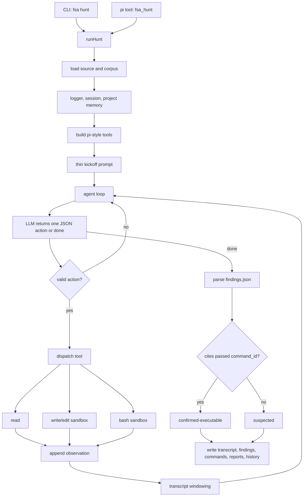

# Architecture

## Boundary

`full-stack-auditor` is now centered on the thin agentic hunt path. The public driver is `fsa hunt`; the model decides the audit strategy and the framework supplies only capabilities, safety, confirmation gates, and replayable state.

The main layers are:

- Agent loop: `src/agent/loop.ts`, `src/agent/prompts.ts`, and `src/agent/hunt.ts`.
- Agent tools: `src/agent/tools.ts` for pi-style read/write/edit/bash capabilities.
- Ingestion: `src/ingest/source.ts` loads authorized source and corpus material with public-safe paths.
- Safety: `src/security/policy.ts` and `src/security/sandbox.ts` gate local command execution.
- Reporting and history: `src/reports`, `src/trace`, and `src/agent/memory.ts`.
- Provider adapters: `src/llm/pi-ai.ts`, with explicit local CLI fallbacks in `src/llm/codex-cli.ts` and `src/llm/claude-code.ts`.
- Pi integration: `src/pi/extension.ts` registers the `fsa_hunt` tool and shell guardrail.

## Hunt Flow

The loop has one protocol: the model emits exactly one JSON tool action per turn, or a `done` object after writing `findings.json`. The framework parses it, runs the requested tool, appends the observation, and calls the model again until the agent finishes or the step budget is exhausted.

## Thin-Layer Rule

A component belongs in hunt mode only if it gives the model something it cannot provide for itself:

- an affordance: read source, write/edit a copied workspace, inspect with local commands, run a local test;
- a guarantee: sandbox isolation, command safety, path redaction, replayable logs, durable history, executable-confirmation gating.

A component does not belong in the default hunt path if it tells the model what bug class to look for, what schedule to follow, or what conclusion to reach. If a human prior is still useful, expose it as an optional model-callable tool.

## Tool Surface

Default tools:

- `read`: read loaded source/corpus or files created in the sandbox.
- `write`: write bounded files into the copied sandbox workspace.
- `edit`: replace text in a file inside the copied sandbox workspace.
- `bash`: run one policy-gated local inspection or test command in the copied workspace.

There are no default bug-class, dataflow, checklist, memory, or report tools. Optional priors should live as extension skills, prompt packs, corpus material, or package add-ons, not as default strategy in hunt mode.

## Confirmation Boundary

The hard rule is that the model cannot confirm a bug by assertion.

`findings.json` records reach `confirmed-executable` only when they cite a `bash` `command_id` that passed with expected exit status and declared success patterns. Otherwise they record as `suspected`.

`bash` routes through `src/security/sandbox.ts` and the command-safety policy. It must stay local-only: source inspection, unit tests, fixtures, local regtest/devnet, forked local nodes, or isolated harnesses. Public network broadcast, transfer, credential use, persistence, exploit optimization, destructive commands, and paths outside the copied workspace are blocked.

The next hardening target is to make executable confirmation less self-certifying: a generic passing test or printed success string should not be enough to prove exploitability. Confirmation should prefer tests that touch target code, exercise the vulnerable condition, and match framework- or verifier-owned success signals.

## Memory And History

Each hunt writes:

- `hunt_transcript.json`: action/observation replay.
- `hunt_findings.json`: raw agent findings.
- `hunt_command_runs.json`: sandboxed local command records.
- `summary.json`: ranked summary.
- `report_<id>.md`: private disclosure drafts.
- `events.jsonl` and `calls/*.json`: trace and model calls.

Per-target memory lives at `<out>/history/<target>/memory.jsonl`. Hunt surfaces recent memory at kickoff and automatically stores parsed findings for later runs.

Project history lives under `<out>/history/<target>/manifest.json` and records sanitized run metadata, findings, and materials. Paths must stay repository-relative or placeholder-based in public-facing artifacts.

## Provider Behavior

Model calls use pi-ai providers by default. `provider=codex-cli` and `provider=claude-code` are explicit local CLI fallbacks. CLI fallbacks run non-interactively and must preserve the hunt contract: in agentic mode they must not inject "do not inspect files" instructions, because the framework tools are how the model investigates.

Model and provider selection stays runtime-configured. Do not assume every model family is available through every provider.

For blind benchmarks with `provider=codex-cli`, set `FSA_CODEX_WEB_SEARCH=disabled` to prevent public-report contamination. Real audits may leave Codex web search at its runtime default or set `FSA_CODEX_WEB_SEARCH=live|cached|disabled` explicitly.

## Pi Integration

The package extension exposes `fsa_hunt` and installs the shared shell-command guardrail. It does not expose a staged audit driver.

The command guardrail lives in `src/security/policy.ts` so non-pi integrations can reuse the same policy.

## Runnable Gates

- `npm run check`: strict TypeScript compile.
- `npm test`: build plus Node tests.
- `npm run mock-hunt`: deterministic offline hunt smoke test.
- `npm run check:blind-discovery`: local seeder regression check for optional planning aids.
- `npm run check:public`: public-surface scan for secrets and local paths.
- `npm run verify`: full local gate.

## White-Hat Constraints

- Audit only authorized source code.
- Keep verification local-only.
- Never broadcast transactions or target public networks.
- Treat model output as untrusted input.
- Validate structured output and sanitize paths.
- Keep audit artifacts private by default.
