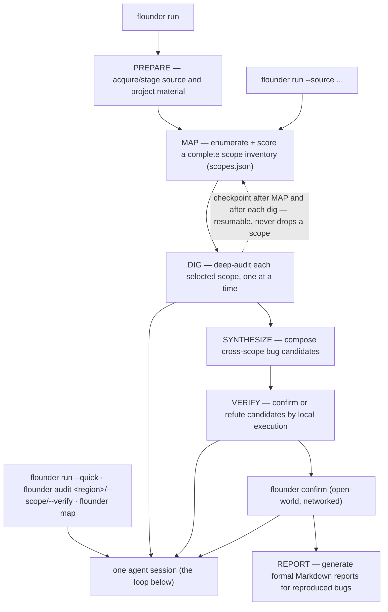
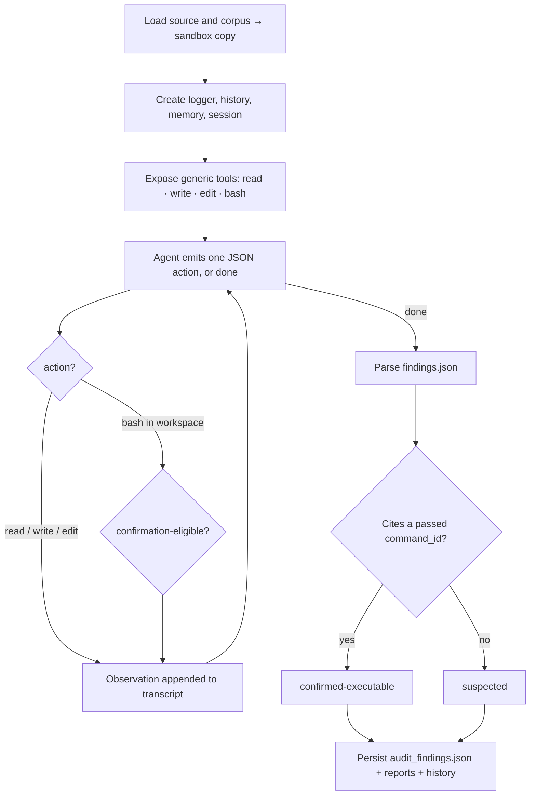

# Using Flounder

Practical guide to driving Flounder from the CLI, the dashboard, the API, and the library. For the design and internals, see [ARCHITECTURE.md](ARCHITECTURE.md). For the product overview, see the [README](../README.md).

Flounder is an autonomous white-hat security auditor. The operator supplies the public-source or authorized target boundary, daemon, provider profile, and budget; the model decides what to read, test, and report. Flags shape *what* it may audit and *how thoroughly* it audits, never *what the bug is*.

The product workflow is prepare -> map -> dig -> synthesize -> verify -> confirm -> report:

- `prepare`: open-world acquisition from a clue, such as a transaction, address, project, repository, package, or link.
- `map`: sealed scope inventory and scoring.
- `dig`: sealed deep audit of selected scopes with local execution proof.
- `synthesize`: sealed cross-scope composition into distinct bug candidates.
- `verify`: sealed local confirm-or-refute pass for suspected or synthesized candidates.
- `confirm`: open-world reproduction against real-world ground truth, with white-hat no-broadcast rules.
- `report`: formal Markdown packaging for reproduced or source-provided locally confirmed bugs.

## Agentic flow

`flounder run` has two entry shapes. With a clue, it is the one-command pipeline: open-world prepare, sealed map/dig/synthesize/verify, open-world confirm, then report generation for reproduced bugs. With source paths already supplied, it runs the sealed **map -> dig -> synthesize -> verify** audit directly. Each phase — and each other verb — runs the same thin agent session; `flounder run --quick`, `flounder audit`, `flounder verify`, and `flounder map` enter that session directly, and `flounder confirm` runs it open-world.



Each session is the thin loop:



### Tools

The tool surface is intentionally small:

- `read`: read loaded source/corpus or files created in the sandbox.
- `write`: write a file into the copied sandbox workspace.
- `edit`: replace text in a file inside the copied sandbox workspace.
- `bash`: run one policy-gated local inspection or test command in the copied workspace.

There are no default bug-class, dataflow, checklist, memory, or report tools. If those are useful later, they should be optional extensions or materials the model can choose to inspect, not framework-owned strategy.

### Confirmation

Findings use these audit statuses:

- `suspected`: the agent reported a candidate without a passing cited local test.
- `confirmed-source`: source-backed evidence exists, but executable verification is still required.
- `confirmed-executable`: the agent wrote `findings.json` with a `command_id` that cites a confirmation-eligible `bash` record.
- `confirmed-differential`: the cited exploit also fails after the framework applies the proposed fix to pristine source.
- `needs-evidence`: local review completed, but external evidence is required to settle the claim.
- `refuted`: independent review or reproduction disproved the claim.

The framework checks the recorded command result. The model cannot upgrade a finding by assertion. Local execution must stay local: unit tests, fixtures, regtest/devnet, forked local nodes, or isolated harnesses only.

## Install

```bash
npm install
npm run build
npm test
npm run sandbox:build  # required for real audits with the default OCI sandbox
```

Command examples use the installed `flounder` binary. In a fresh source checkout
before installing or linking the package, replace `flounder` with
`node dist/cli.js`.

Start the local product surface from a source checkout:

```bash
node dist/cli.js ui                 # dashboard + control plane at http://127.0.0.1:4500
node dist/cli.js ui --no-daemon     # control plane only
node dist/cli.js daemon start --server http://<server>:4500 --token <token>   # remote executor
```

After installing or linking the package, the same commands are:

```bash
flounder ui                 # dashboard + control plane at http://127.0.0.1:4500
flounder ui --no-daemon     # control plane only
flounder daemon start --server http://<server>:4500 --token <token>   # remote executor
```

For live model runs, configure provider credentials on each daemon machine. Subscription/OAuth providers use `flounder daemon provider login <provider>`; API-key providers can be supplied through the daemon process environment or local secret manager. Check a machine with `flounder daemon provider check <provider>`. For `openai-codex`, an agent can trigger user auth by running `flounder daemon provider login openai-codex`; the command prints a browser URL or device-code instructions for the user to complete, then saves daemon-local auth. If `~/.pi/agent/auth.json` already has the same provider, Flounder imports that provider entry into `~/.flounder/agent/auth.json` on login/check. The server stores provider profiles and routes jobs, but provider credentials stay on the daemon. Do not commit credentials, local environment files, private corpora, or machine-specific paths.

## Execution Sandbox

Model-generated commands run in a copied workspace through `src/security/sandbox.ts`. The default backend is `auto`: on Apple silicon macOS it first uses Apple's `container` runtime when the selected image and sealed network are ready; otherwise it uses Docker-backed OCI when the image is available. If no sandbox engine is ready, it refuses execution with a policy error instead of silently falling back to the host.

For the Docker-backed path, install and start Docker, or a Docker-compatible runtime that provides the `docker` CLI, before running real execution-confirming audits. Build the default Docker image with:

```bash
npm run sandbox:build
```

Use `--sandbox-backend oci` to require the Docker-backed container path and fail if the image is missing. Use `--sandbox-image <image>` to provide a target-specific image with extra toolchains.

On Apple silicon macOS systems, `auto` tries Apple's `container` runtime before Docker. Install and start `container` on the daemon machine, build or pull the selected image into that runtime, then either let `auto` pick it or require it explicitly:

```bash
flounder run --source ./src --build-root . --sandbox-backend apple-container --sandbox-image flounder-sandbox:latest
```

This backend maps the copied workspace, cache mount, isolated environment, CPU/memory limits, read-only root filesystem, capability drop, and tmpfs mounts through `container run`. For sealed `network=none` commands it creates or reuses an internal host-only, no-DNS `flounder-sealed` network. The Docker image auto-build helper does not populate the Apple container runtime; if `auto` cannot use Apple `container`, it continues to the Docker-backed OCI path.

The bundled image is only the default baseline. It cannot cover every compiler, prover, framework, package manager, or blockchain toolchain a real audit may need. For specialized targets, build or pull a reviewed image outside the audit loop and pass it explicitly:

```bash
flounder run --source ./src --build-root . --sandbox-image your-audit-image:latest
```

Flounder also ships curated target-specific image recipes for common audit
ecosystems. These extend `flounder-sandbox:latest`; build the baseline first,
then the specialized image you need:

```bash
npm run sandbox:build
npm run sandbox:cairo:build  # flounder-sandbox:cairo, with Scarb + Starknet Foundry
npm run sandbox:ton:build    # flounder-sandbox:ton, with TON Blueprint + FunC/Tolk/Tact tooling
```

For Cairo targets that pin older toolchains in `.tool-versions`, build a
target-specific Cairo image from the reviewed recipe instead of relying on the
latest generic Cairo image:

```bash
npm run sandbox:cairo:target -- --target <target-root> --execute
```

The command reads `scarb` and `starknet-foundry` pins, passes reviewed release
checksums into `docker/flounder-sandbox-cairo.Dockerfile`, and tags the result
as `flounder-sandbox:cairo-scarb-<version>-snfoundry-<version>`. Omit
`--execute` to print the exact build command for review, or add
`--runtime container` when building directly into the Apple container runtime.
Unreviewed Starknet Foundry versions fail closed until both Linux release
checksums are provided explicitly.

Use them explicitly for matching targets:

```bash
flounder run --source ./src --build-root . --sandbox-image flounder-sandbox:cairo
flounder run --source ./src --build-root . --sandbox-image flounder-sandbox:cairo-scarb-2.12.0-snfoundry-0.49.0
flounder run --source ./contracts --build-root . --sandbox-image flounder-sandbox:ton
```

Treat image construction as a daemon/operator responsibility. The agent can identify missing tools and propose a Dockerfile or image plan, but unrestricted `docker build` or `docker pull` from inside model-directed execution would expand the trusted boundary and can undermine the sandbox. If automated image synthesis is enabled in a deployment, keep it as a separate controlled prepare step with human review or a locked template, pinned base images, and a resulting image digest recorded in the run.

Prepare warm-up failures are product-visible resource blockers. When a pinned
tool check or dependency/build warm-up fails, Flounder records a normalized
`resource-request` backlog row with the failed command, a short diagnostic, and
a retry command. This happens even if the model never writes
`resource_requests.json`, so `latestRunHealth.status=needs-resource` means the
agent should inspect the blocker, retry safe toolchain, sandbox image,
dependency, source, or fork setup where possible, and ask the operator only for
explicit credentials, authorization, or unavailable external resources before
rerunning the same blocked verification work.

Host mode exists as an explicit trusted-local escape hatch for environments where Docker/OCI is unavailable or for deterministic fixture tests:

```bash
flounder run --source ./src --build-root . --sandbox-backend host --allow-host-execution
```

Host execution keeps the copied workspace, isolated `HOME`, temp directories, and package-cache environment, but it cannot enforce command-level network sealing or provide kernel-level filesystem isolation, and it inherits the host process/toolchain boundary. Do not use it for untrusted targets, malicious dependencies, or real model-generated exploit code unless the operator deliberately accepts that risk. The same opt-in can be supplied by setting `FLOUNDER_ALLOW_HOST_EXECUTION=1`; the backend and image can be set with `FLOUNDER_SANDBOX_BACKEND` and `FLOUNDER_SANDBOX_IMAGE`.

Network policy is phase- and command-specific. Sealed `run --source` / `map` / `audit` inspection and confirmation commands use Docker `--network none` in the Docker-backed OCI backend, and an internal host-only, no-DNS `flounder-sealed` network in the Apple container backend. Dependency warm-up and explicit `purpose=build` commands may use the configured package-registry window. In open-world `prepare` and `confirm`, the framework grants egress only to a narrow capability surface: read-only HTTP, explicit HTTPS Git fetch/clone, read-only GitHub/chain queries, and local-fork commands. Arbitrary model-selected programs still run with `network=none`, Foundry FFI is forced off, and broadcast, value-moving, destructive, credential, and persistence behavior remains forbidden.

## Materials

- `--source <paths...>` — the code under audit. Point it at the buildable project root (the directory holding the manifest/lockfile) so the agent can execution-confirm.
- `--build-root <dir>` — when `--source` is narrow inside a larger workspace, the build root the sandbox copies so the project compiles (the model still reads only `--source`). A buildable workspace is what separates `confirmed` from `suspected`.
- `--corpus <paths...>` — design **intent** the model reads to derive what the code MUST enforce: the project's real specs, whitepapers, design notes, prior audits, or a strictly factual incident brief. Corpus is context, never answers — it must not name the bug, its location, or its mechanism, and you should not author it yourself. Give the spec and let the model find the gap.

## Commands

Most users should start from the dashboard or from `flounder run <clue>`. The CLI talks to the same control plane as the UI; if no server is reachable, start `flounder ui` first.

CLI layout is intentionally split by where the command runs:

- **Workflow verbs stay top-level.** Examples: `flounder prepare`, `flounder run`, `flounder map`, `flounder audit`, `flounder verify`, `flounder confirm`, `flounder report`, and durable `flounder group` evaluation workflows.
- **Server/control-plane resources live under `flounder server ...`.** Examples: `flounder server project list`, `flounder server run list`, `flounder server finding list`, `flounder server daemon list`, `flounder server daemon-token mint`.
- **Daemon-machine local operations live under `flounder daemon ...`.** Examples: `flounder daemon start --server ... --token ...`, `flounder daemon provider login openai-codex`, `flounder daemon provider check openai-codex`.

Resource commands use the same noun/action style everywhere: `flounder server finding list` reads the global finding index, `flounder server run list` reads global run history, `flounder server daemon-token mint` creates a daemon connection token on the control plane, and `flounder daemon provider list/login/check` manages provider auth on the daemon machine. The SQLite file is an implementation detail, so `db` is not part of the public CLI vocabulary.

The sealed verbs (`run --source`, `map`, and `audit`) share the tools, the confirmation gate, and the network-sealed boundary; they differ only in what slice they cover. `prepare` and `confirm` are open-world phases with the white-hat network policy.

| Command | What it does |
|---|---|
| `flounder prepare <clue>` | open-world acquisition before map: turn a transaction, address, project, package, repository, or link into staged source, corpus, dependency closure, and deployment-match evidence |
| `flounder run <clue>` | one-command workflow: prepare the target, run the sealed map -> dig audit, confirm reproduced findings when possible, then generate reports |
| `flounder run --source <paths...> --target <name>` | source-provided sealed audit: map -> dig -> synthesize -> verify. MAP enumerates the inventory, DIG deep-audits selected scopes, synthesis composes cross-scope candidates, and Verify settles unresolved claims. Resumable, never silently drops a scope. (`--quick` runs a single breadth pass instead.) |
| `flounder map --target <name> --source <paths...>` | enumerate + persist the scope inventory only (`audit_scopes.json`), no dig — inspect or curate scopes before auditing |
| `flounder audit <region> --source <paths...>` | deep-audit one region you already care about (skip the map) |
| `flounder audit --scope <id,...> --source <paths...>` | dig specific inventory items after a `flounder map` (the human-in-the-loop pick over the complete map) |
| `flounder audit --verify <findings.json> --source <paths...>` | confirm-or-refute existing suspected findings by execution — the standalone confirmation step on a prior run's `audit_findings.json` |
| `flounder verify <findings.json> --source <paths...>` | alias for `audit --verify`; confirm-or-refute existing suspected findings by execution |
| `flounder confirm <run-dir> --source <paths...>` | open-world: reproduce a run's findings on the real target |
| `flounder report --project <uuid\|name> [--finding <id>...] [--all]` | generate missing formal reports, regenerate selected reports, or regenerate every current reportable finding |
| `flounder group create --manifest <file>` | create a durable evaluation, replay, batch, or multi-target group from validated work items |
| `flounder group start <uuid\|name> [--parallel <n>]` | start or resume bounded work-item scheduling through the existing daemon queue |
| `flounder group status|pause|cancel|report <uuid\|name>` | inspect or control durable group state, or regenerate its result report without model work |
| `flounder group retry <work-item-id>` | retry a blocked item after setup repair while preserving prior attempt evidence |
| `flounder experiment create --name <name> --baseline <group> [--candidate <group>] --editable-file <paths...>` | maintainer mode only: mine verifier-grounded Evaluation failures and create a bounded Flounder source candidate proposal |
| `flounder experiment status|attach|proposal|evaluate|brief <uuid\|name>` | maintainer mode only: inspect/refine the proposal, attach a paired candidate Evaluation, run the deterministic promotion gate, or export the candidate brief |
| `flounder history import-run --target <name> --run <dir>` | import an existing run directory into tracked history |

`prepare` and the sealed verbs are **unbounded by default** (a run ends when the model is done, not at a step count) — a fixed budget silently truncates useful acquisition or a productive dig. Standard coverage caps only the next dig batch to 30 scopes; it does not cap prepare, map, or per-scope dig turns. Cap a phase only when you want to: `--max-steps` for `prepare`, `--map-steps` / `--dig-steps` for map/dig, or `--max-steps` for `run --quick` / `audit <region>`. A killed run **resumes** (it skips MAP and the already-audited scopes), so longer unbounded runs are safe to interrupt.

## Evaluation run groups

Run groups are the durable outer loop around the existing audit kernel. They do
not add a second audit strategy or confirmation path. Each work item resolves to
an existing sealed `run` or `audit --verify` job, executes on a daemon, and stores
lifecycle separately from its evidence outcome:

Each work item gets a hidden tracking project keyed by its durable UUID. This
keeps Evaluation runs and findings out of the normal Projects and Findings views
even when a benchmark target has the same display name as a real project. Use
the Findings source filter to inspect Evaluation evidence explicitly. On a
shared daemon, queued Project jobs are claimed before queued Evaluation jobs;
running jobs are allowed to finish. Every attempt also receives a fresh internal
history namespace, so retries and paired candidates cannot inherit scopes,
findings, transcripts, or model memory. Only the target dependency cache is
shared.

- lifecycle: `queued -> claimed -> running -> finished|failed|cancelled`;
- outcome: `confirmed`, `refuted`, `findings_reported`, `no_findings`, `blocked`,
  or `invalid`;
- `blocked` covers setup, build, daemon, or resource failure and is never scored
  as a negative security result;
- a manifest `command` is descriptive evidence metadata only. It is never run
  directly; confirmation still requires the normal policy-gated audit tools;
- group manifests cannot select host execution or open-world access. Real-target
  work must use `flounder confirm` and its existing no-broadcast policy.

A minimal positive/control manifest looks like:

```json
{
  "version": 1,
  "name": "logic-regression",
  "kind": "evaluation",
  "parallelism": 2,
  "config": {
    "provider": "openai-codex",
    "thinking": "xhigh"
  },
  "items": [
    {
      "itemKey": "positive",
      "kind": "benchmark-case",
      "targetBundle": {
        "target": "eval-c1-f1-s1",
        "targetClass": "logic",
        "sourcePaths": ["./fixtures/c1"],
        "corpusPaths": ["./docs/design.md"]
      },
      "materialPolicy": {
        "posture": "blind",
        "materials": [
          {
            "path": "./docs/design.md",
            "provenance": "official-docs",
            "operatorLabel": "design-intent",
            "policyDecision": "included",
            "reason": "Answer-free design intent."
          }
        ]
      },
      "evidenceContract": {
        "kind": "benchmark-oracle",
        "expectedOutcome": "detect-positive",
        "requiresDifferential": true,
        "requiresRefutation": true,
        "networkPolicy": "sealed"
      }
    },
    {
      "itemKey": "safe-control",
      "kind": "benchmark-case",
      "targetBundle": {
        "target": "eval-c1-f2-s1",
        "targetClass": "logic",
        "sourcePaths": ["./fixtures/c2"],
        "corpusPaths": []
      },
      "evidenceContract": {
        "kind": "benchmark-oracle",
        "expectedOutcome": "reject-positive",
        "networkPolicy": "sealed"
      }
    }
  ]
}
```

Relative material paths are resolved against the manifest directory by the CLI:

```bash
flounder group create --manifest ./evaluation.json
flounder group start logic-regression --parallel 2
flounder group status logic-regression
flounder group report logic-regression
```

If setup, build, daemon, or resource failure blocks an item, retry that item by
its numeric id after fixing the blocker:

```bash
flounder group retry <work-item-id>
flounder group start logic-regression
```

Only blocked failed/cancelled items are retryable. Each dispatch writes an
immutable attempt row, so retrying never overwrites the prior job, run, error,
or evidence. A benchmark miss is a real sample, not a retryable infrastructure
failure; represent repeated samples as separate work items.

Scored items require a terminal `done` run and a `healthy` run-health verdict.
Positive evidence that requires independent refutation is blocked unless the
persisted refutation stage completed without errors. This prevents shallow,
resource-limited, or partially evaluated controls from being counted as safe.

Keep every model-visible target name, directory, filename, comment, and corpus
entry neutral. Blind benchmark/replay items cannot add a free-form `scopeNote`.
`itemKey` and `expectedOutcome` stay in the control plane, but a source path
such as `known-bug-positive/` would leak the answer into the audit and invalidate
the evaluation.

Every declared corpus path needs one explicit material-policy decision; there
is no default inclusion. An unresolved `warning` blocks dispatch until the
operator changes it to `included` or `excluded`, so a warning never silently
crosses the blind-material boundary.

For a `targetClass` of `capability-surface`, the target bundle must also declare
neutral `entrypoints`, `inputs`, `effects`, `authorities`, `boundaries`, and
local fixtures. Flounder supplies the semantic fields as planning context to the
model; fixture paths remain control-plane metadata and must already be reachable
under the declared source/build inputs. Neither can confirm a finding by itself.
Use local fake mail, PR, MCP, browser, or repository fixtures rather than real
accounts and tokens.

## Maintainer-only Harness experiments

Harness experiments are a governed outer loop over finished Evaluation groups
for maintainers improving Flounder source. They are not a normal Project feature,
do not run after each audit, and stay disabled unless the control plane is
explicitly started with `flounder ui --maintainer`.
They do not let a model change its own judge or deploy itself:

1. Mine baseline work items that missed a positive, failed a control, were
   blocked, or violated policy. Clustering uses the persisted verifier outcome,
   causal status, and terminal reason rather than text similarity alone.
2. Record passing positive/control behavior that a candidate must preserve.
3. Produce a candidate proposal whose files are limited to an explicit allowlist
   under `prompts/`, `skills/`, or approved agent-harness modules.
4. Run the same stable work-item keys and contracts as a candidate Evaluation,
   normally from a daemon/workspace running the candidate branch.
5. Apply the product-owned gate: sufficient repeated positive/control samples,
   distinct positive cases and bug families, enough hidden holdouts with every
   holdout passing, zero paired regressions, every safe control passing, no
   unresolved blocked or invalid work, and configured duration/attempt budgets.

`caseId`, `caseFamily`, `targetStack`, and `holdout` live only in the evaluator
contract. Holdouts are excluded from failure mining, so a candidate cannot learn
their mechanism from the experiment that later judges it.

The gate returns `promote`, `reject`, or `needs-more-samples`. It never changes
code, creates an unreviewed merge, or deploys a release. The evaluator, expected
answers, material policy, sandbox/command safety, confirmation/refutation,
promotion policy, merge, and deployment authority remain outside the loop.

A buildable four-item baseline is included at
`fixtures/harness-evolution/baseline.json`. It has two repeated positive samples
and two repeated safe controls with neutral model-visible names:

```bash
flounder ui --maintainer

flounder group create --manifest fixtures/harness-evolution/baseline.json
flounder group start harness-evolution-baseline --parallel 2

flounder group create --manifest fixtures/harness-evolution/baseline.json \
  --name harness-evolution-candidate
flounder group start harness-evolution-candidate --parallel 2

flounder experiment create \
  --name prompt-candidate-1 \
  --baseline harness-evolution-baseline \
  --candidate harness-evolution-candidate \
  --editable-file src/agent/prompts.ts
flounder experiment evaluate prompt-candidate-1
flounder experiment brief prompt-candidate-1
```

In a maintainer-mode dashboard, open **Evaluations → Harness · Maintainer** for the same flow. The detail
view shows a compact baseline/candidate comparison, mined weaknesses, bounded
proposal, family/stack diversity, holdout pass rate, protected boundary, and the
promotion decision. Findings remain the
product's security output; Harness experiments measure whether the auditor got
better.

## Most effective setup

For a real audit, use the dashboard flow:

1. Start `flounder ui`.
2. Create or connect an execution daemon.
3. Authenticate the daemon's provider with `flounder daemon provider login openai-codex` and verify with `flounder daemon provider check openai-codex`. This is the command an agent should run when it needs the user to complete OpenAI Codex auth.
4. Create or reuse a provider profile that selects provider, model, and thinking level. Fresh installs seed `openai-codex · gpt-5.6-sol · xhigh` and `claude-code · opus 4.8 max`; the selected daemon still needs local auth for every provider used by the default profile or phase overrides. Existing projects retain their selected profile until it is changed explicitly.
5. Create a project, describe the task/clue in the "What should Flounder do?" box, select its execution daemon and default provider profile, add source/build/corpus paths, and start a run. The project directory defaults to the project UUID under the daemon workspace, which stays stable if the display name changes. Leave **Run after create** checked to start the pipeline immediately.

The equivalent source-provided CLI launch is:

```bash
flounder run \
  --target protocol \
  --source ./contracts --build-root . \
  --corpus ./docs/specs \
  --map-steps 60 --dig-steps 60 --dig-samples 2
```

- Set `--build-root` so the dig can execution-confirm — without it you only get `suspected` findings.
- Give generous budgets and **do not interrupt a dig**; a decisive obligation can surface late in its step budget.
- `--dig-samples K` unions K independent passes (variance reduction); `--dig-concurrency N` digs N scopes in parallel; `--verify-concurrency N` settles N findings in isolated workspaces (default 2); `--remap` re-enumerates. Reliability comes from coverage and repetition, not prompt tuning.
- The codex provider (`openai-codex`) is the recommended autonomous path; each daemon needs a one-time `flounder daemon provider login openai-codex` unless Flounder imports an existing pi auth entry for that provider.

## Engagement modes

Project config can include `engagement.kind` to tell the control plane how the
work will be judged:

- `standard`: general authorized review. This is the default.
- `bug-bounty`: normal public or private bug-bounty work. Prepare may collect
  program scope, deployments, provenance, and known-issue signals. Real-target
  Confirm remains expected when a live target exists, and reports should wait
  for reproduced or locally confirmed findings that pass scope, novelty,
  duplicate, known-issue, impact, and payout-readiness gates.
- `bug-bounty-contest`: time-limited contest work. The project can run short
  settled batches so candidates move through verify/refute/report quickly before
  opening the next scope batch. Contest strategy supports `batchScopes`,
  `digConcurrency`, `skipRealTargetConfirm`, and
  `appendMapWhenExhausted`. Source-only local confirmation can be reportable
  when the venue rules do not require live-target reproduction, but suspected
  findings still must be verified/refuted before submission.

A contest Continue run first settles missing verify/report work. After the
current mapped inventory is exhausted, append-map expansion preserves audited
scope status, submitted or duplicate finding state, and prior coverage while
asking MAP for novel scopes. Use `--append-map` or `--expand-map` from the CLI
when driving this manually; use `--remap` only when intentionally replacing the
inventory.

Contest mode surfaces stop-review signals instead of enforcing a universal stop
rule: elapsed review window, inventory exhausted, and recent scope batches with
low locally confirmed yield. Operators should use those signals with duplicate
rate, report backlog, resource requests, and remaining contest time to decide
whether to continue, append-map, change direction, or pause.

## Confirmation ladder

`suspected` → `confirmed-executable` (a cited `purpose=confirm` test actually passed) → `confirmed-differential` (the model's fix, applied to pristine source, blocks the exploit). An independent refutation skeptic then re-judges every confirmation: a **vacuous** one — a PoC that only triggers by giving a trusted/pinned component behavior a real attacker cannot cause — is downgraded and flagged, never silently dropped. A downgraded finding gets one **appeal**: it rebuilds a faithful PoC answering the exact objection, and if that survives re-judgement the finding is recovered; the original confirmation, the refutation, and the appeal outcome are all kept (`--no-appeal` to skip). Build the PoC the way the attacker would — assume only capabilities a real attacker has, exercise the real components, and never grant yourself something the deployed system would deny.

## Examples

**Zcash — Rust ZK circuits (stack-agnostic, execution-confirmed).** Audit a circuit crate for a soundness gap: `--source` the crate, `--build-root` the cargo workspace, `--corpus` the circuit's design spec. `flounder run` makes MAP enumerate the circuit's constraints — including operands the spec treats as given, a classic under-constrained-witness bug — and the dig write a `MockProver` malicious-witness test. A real crate-internal soundness bug reached `confirmed-differential` this way (the model wrote the exploit, the framework built and ran it, then applied the model's fix and re-ran to show it blocked). A subtle one needs `flounder audit --scope <id>` + `--dig-samples` and an uninterrupted dig.

**Aztec — Solidity rollup (incident investigation and blind audit).** Two scenarios on the deployed `RollupProcessorV3`:

- *Incident investigation* — give the agent the real deployed contracts (`--source`/`--build-root` on the Foundry project), the official Aztec specs, and a strictly factual on-chain incident brief (`--corpus`); nothing you authored, no hand-picked scope. Let it investigate, then `flounder audit --verify` (or the dig) confirms by execution.
- *Blind audit* — the same materials **minus** the incident brief. From scratch, `flounder run` independently flagged the decode/settlement region and reached `confirmed-differential` on an unbound-input bug (`numRealTransactions` not bound to the verifier's public-input hash), with a faithful proof-of-malleability PoC — with no knowledge that an incident had ever occurred.

## Local checks

```bash
npm run mock-audit     # offline smoke test with the deterministic mock model
npm run check:public  # fast public-surface scan: current tree + latest commit
npm run verify        # full local verification gate
```

## Confirm — open-world reproduction

`flounder confirm <run-dir> --source <paths...>` takes a finished `flounder run` to a real-world standard of certainty and writes a submit/no-submit decision sheet. It is the open-world counterpart to the sealed `run`: the model may request explicit read/fork/fetch capabilities, while arbitrary model code stays network-sealed.

Confirm is **finding-grained and resumable**: each finding gets a real-target outcome (`reproduced` / `not-reproduced`), and a re-run skips the ones already decided. The CLI form confirms a whole run dir; from the dashboard you can **Confirm** a single finding or all pending findings of a project (it reproduces only what's still undecided, including findings added by a later **Continue** run).

```bash
flounder confirm ~/.flounder/protocol-<timestamp> \
  --source ./contracts --build-root . \
  --provider openai-codex
```

What it does, in one session:

1. **Freeze + fingerprint** the run's findings (sha256 + timestamp) *before* any network access — anchoring the "found blind, no network" provenance.
2. **Reproduce** each finding against **real ground truth** — the model decides what that is for the target (a mainnet fork of the deployed contract and its real verifier, a real released package, a local node) and writes the reproduction itself. A finding is marked `reproduced` only if it triggers on the real target, using only attacker-real capabilities, with the effect **exhibited** as a concrete observable (a drained balance, a forged output, an accepted invalid input) — never a printed string, never an argument.
3. **Consolidate** by execution: a fix-equivalence matrix cross-applies each bug's fix against the others' PoCs and merges any a single fix neutralizes — *distinct bugs decided by execution, not by similar titles*.
4. **Check novelty** online (advisories, issues, post-mortems) — used only as a *lead* and as a *disqualifier* for already-disclosed bugs, never as proof.
5. **Decide**: `confirm_decision.json` + `confirm_report.md`, one row per distinct bug — reproduced?, evidence, novelty/corroboration, and a `submit-candidate` / `needs-human` / `drop` recommendation. For bounty-like engagements with reproduced bugs, confirm also writes `impact_inventory.json`: a structured live exposure / affected deployment inventory used to support or block the live-impact and payout gates.

The three rules the prompt enforces: **execution is the only truth**; **the web is a lead, never proof**; **only attacker-real capabilities** (the same faithful-PoC rule the `run` refutation applies). A finding that only reproduced under a substituted trusted component, an unreachable precondition, or assumed state does **not** clear the bar — it is recorded `not-reproduced` with the exact crutch named.

`flounder confirm` is **unbounded by default** (reproduction is heavy; it ends when the model is done); pass `--max-steps N` to cap it. It needs a session-capable provider (e.g. `openai-codex`, authenticated on the daemon with `flounder daemon provider login openai-codex`) — the mock/CLI fallbacks cannot fork a live network. It **auto-resumes** an interrupted prior confirm of the same run dir: it carries the already-settled rows forward and reproduces only the rest, checkpointing the decision sheet each turn so a kill loses no finished work (`--fresh` starts over).

**White-hat for the open world:** confirm may **fork and read** live networks/data to reproduce locally, but it must **never broadcast** a transaction to a non-local network, move funds, or write to any live system. Replay the exploit against a *local* fork; never push it to the live one (`src/security/policy.ts`).

> Validated end-to-end: pointed at a prior `run`'s Aztec findings, `flounder confirm` reproduced the real `numRealTransactions` accounting bug on a mainnet fork (real proxy + real verifier, flipping one attacker-controllable byte) and execution-*refuted* the findings that only worked against a mocked verifier/proxy — zero false reproductions.

### Reproduction inside a run

Inside `flounder run`, reproduction is part of the audit itself: the agent calls `bash` to write and run local tests in the copied workspace, and a finding only reaches `confirmed-executable` when a `purpose=confirm` test passes. The agent writes files only inside a copied workspace under the run directory; it never modifies the target source tree. Command safety blocks public-network broadcast, transfer, credential, persistence, and exploit-optimization flows.

## Domain profiles

Config files under `configs/` can provide source paths, corpus paths, project context, and optional domain hints. In audit mode these are context, not a framework-owned checklist. They are **opt-in and off by default** — a plain `flounder run` carries no preset bug knowledge; pass `--config` only when you want to seed a known vulnerability class. See [configs/README.md](../configs/README.md) for when to use them and the line a profile must not cross.

```bash
flounder run \
  --config ./configs/solidity-contract-audit.default.json \
  --target contract-audit \
  --source <contract-source-paths...> \
  --corpus <specs-docs-and-prior-audit-material...> \
  --provider openai-codex --model gpt-5.6-sol --thinking xhigh
```

Optional stack-specific notes: [SOLIDITY.md](SOLIDITY.md) covers the Solidity/EVM path, [STARKNET.md](STARKNET.md) covers Cairo/Starknet setup, [TON.md](TON.md) covers TON/FunC/Tolk/Tact setup, and `configs/zk-constraint-audit.default.json` provides optional ZK/proof-system context. They are examples of context, not product modes.

## Pi package

Try the package locally from this directory:

```bash
pi -e flounders
```

The extension registers workflow tools that mirror the top-level verbs:

- `flounder_prepare`: open-world target acquisition from a clue.
- `flounder_run`: current `run` semantics. With a clue, it runs prepare -> sealed map/dig/synthesize/verify -> confirm -> report; with `sourcePaths`, it runs the sealed source audit.
- `flounder_map`: sealed scope inventory only.
- `flounder_audit`: sealed dig/region/scope/verify workflow.
- `flounder_confirm`: open-world reproduction of finished run findings.

It also installs the shared command-safety guardrail for shell commands.

## Agent skill

The easiest way to use Flounder with Codex, Claude Code, or another local coding agent is to hand the agent the skill prompt:

```text
Audit this repository with Flounder.
```

Install from GitHub when the source checkout is not local:

```bash
npx skills add adshao/flounder --skill flounder -g -a codex -a claude-code
```

Install from the current checkout during local development:

```bash
npx skills add . --skill flounder -g -a codex -a claude-code
```

After installing the skill, agents should trigger it from natural requests about Flounder audits, public-source or authorized source review, smart-contract or ZK audit work, daemon/provider setup, verifying suspected findings, confirming real findings, or collecting execution-backed bug reports. The skill is the agent operating manual: it covers setup, daemon-local provider auth, projects, provider profiles, runs, live activity, next-action decisions, confirm, and final bug packages.

## Outputs

Each audit writes:

- `audit_transcript.json`: replayable action/observation trace.
- `audit_findings.json`: raw agent-reported findings.
- `audit_command_runs.json`: local sandbox command records.
- `run_health.json`: health verdict for the run (`healthy`, `needs-coverage`, `needs-resource`, `shallow`, or `infra-failed`).
- `coverage_gaps.json`, `resource_requests.json`, `followup_scopes.json`: discovery backlog artifacts for coverage gaps, missing resources, and adjacent scopes to audit later.
- `scope_outcomes.json`: current-material per-scope obligation, blocker, and composition coverage evidence. This is not a finding artifact.
- `summary.json`: ranked finding summary and coverage.
- `report_<id>.md`: private disclosure drafts.
- `events.jsonl` and `calls/*.json`: audit trace and model-call records.
- `<out>/history/<target>/memory.jsonl`: durable per-target memory.
- `<out>/history/<target>/manifest.json`: project-level history.

Each `flounder confirm` writes:

- `confirm_provenance.json`: sha256 + timestamp of the run findings, frozen before any network access.
- `confirm_decision.json`: the decision sheet — one row per distinct bug (reproduced?, evidence, novelty, recommendation).
- `impact_inventory.json`: bounty-like live exposure / affected deployment evidence when confirm reproduced a bug and attempted payout-impact adjudication.
- `confirm_report.md`: the human-readable decision sheet.
- `confirm_equivalence.json`: the fix-equivalence matrix (which fixes block which PoCs) and the resulting clusters.
- `confirm_transcript.json`, `events.jsonl`, `calls/*.json`: the open-world session trace.

When the execution-based equivalence matrix proves that one fix neutralizes
several PoCs, the project lifecycle keeps one canonical finding and marks
reviewable variants duplicate. Explicit submitted or ignored tracking choices
remain authoritative.

Run artifacts are private by default. Redact before sharing outside the trusted project context.

### Tracking Commands

Every run records its metadata to a local tracking store at `<out>/flounder.db`. The default `<out>` is `~/.flounder`, so a normal install keeps the tracking database at `~/.flounder/flounder.db`, run artifacts at `~/.flounder/<target>-<timestamp>/`, durable history/build cache at `~/.flounder/history/<target>/`, provider auth at `~/.flounder/agent/auth.json`, and the default daemon workspace at `~/.flounder/workspace`. Existing pi provider credentials can be imported from `~/.pi/agent/auth.json` into the Flounder auth file. System temp directories are reserved for short-lived scratch such as CLI subprocess working directories and inline verify payloads.

The tracking store records the project, run lifecycle, run material fingerprint, run health, discovery backlog, scope coverage, canonical findings, exact occurrences and key aliases, Verify/Confirm/Report attempts, confirm decisions, Evaluation run groups, and governed harness experiments. Blocked phase work is input-addressed: unchanged inputs stay blocked until materials change or an operator requests a focused retry. It holds metadata and **paths** to on-disk artifacts, not private artifact content. Inspect it across all projects without reading run dirs:

```bash
flounder server project list                    # every project: scope coverage, finding counts, latest run
flounder server run list                        # global run history
flounder server run list --project <name>       # run history for one project
flounder server finding list                    # global finding index
flounder server finding list --project <name>   # findings for one project
flounder server daemon list                     # registered execution daemons
flounder server daemon-token mint [name]        # create a connection token for a remote daemon
flounder history import-run --target <name> --run <dir>   # import an existing run directory
```

This is the backend the dashboard reads from; it is written live by each run (not rebuilt from files).

## Dashboard

```bash
flounder ui                 # dashboard at http://127.0.0.1:4500 + a co-located executor daemon
flounder ui --no-daemon     # control plane only — connect your own daemon(s) elsewhere
flounder daemon start --server http://<server>:4500 --token <token>   # run the executor on another machine
```

A web dashboard to track and drive audits across projects, updating live via SSE. A project is pinned to an **execution daemon** and a **default provider profile**. A provider profile is the model strategy: provider, model, thinking level, and optional role defaults. The project can also override the provider profile per phase (`prepare`, `map`, `dig`, `confirm`) when one phase needs a different model or reasoning level. The selected daemon must be authenticated for every provider profile the project can use.

Project creation starts with a task/clue composer so the operator can say what the audit should do. The clue is stored as `config.prepareClue` and reused by Prepare unless a launch supplies a new one. Project directories live under the daemon workspace and default to the project UUID, not the display name. The project list defaults to newest-created first, supports pinning, drag ordering, and archive/unarchive; archived projects move to Settings and lose their pin.

A project's detail is the **prepare -> map -> dig -> synthesize -> verify -> confirm -> report** workflow: it shows the current phase, elapsed timing, coverage, run health, live activity, and the scope being dug. Dig proves claims during discovery; **Verify candidates** handles only unresolved, synthesized, or imported claims, with bounded isolated concurrency. Continue resumes interrupted Dig first, then starts directly at Verify/Confirm/Report when only evidence-tail work remains. Unchanged blocked work is not drained repeatedly; changed inputs reopen it automatically, and finding detail can request a focused retry. Next Actions remains the agent-owned queue for coverage, setup, and routing work.

The cross-project **Findings** view defaults to real Project findings and their submission state. A row shows only the current workflow phase and blocker/next action, keeping the list compact; opening it reveals occurrences, independent-review state, every local/real-target/report attempt, and phase-specific retry. Its source filter can explicitly show Evaluation evidence or all sources; Evaluation rows link to their group and stay read-only for disclosure tracking. Project findings retain project, audit-status, and tracking filters. The default **Active findings** filter hides `ignored` rows, while the **Ignored** view can restore them to `open`. Settings holds provider profiles, daemon CRUD, and archived projects.

The top-level **Evaluations** view drives durable run groups for audit campaigns, benchmark cases, regression replays, and claim verification. Create a draft, add work items with an explicit target bundle, material policy, evidence contract, case/family/stack identity, and optional hidden-holdout flag, then start, pause, resume, or cancel the group. Each row keeps lifecycle state separate from its evidence verdict: a finished item is not shown as passing unless its persisted result satisfies the contract, while blocked and invalid work never enter the score. Expand an item to inspect source/corpus policy, confirmation requirements, result evidence, and every attempt; blocked failed or cancelled items can be retried without losing earlier attempts. Positive recall and safe-control pass rates appear for evaluation-oriented groups, and the Report action regenerates Markdown from stored evidence without rerunning model work. Only `flounder ui --maintainer` adds **Harness · Maintainer**, which a repository agent uses to mine finished baselines, refine bounded source proposals, attach isolated candidate groups, compare paired metrics and hidden holdouts, and prepare a reviewable PR without gaining merge or deploy authority.

Execution is **decoupled** from the dashboard: the `flounder ui` server is a **control plane** (REST API + SQLite + a job queue) and the audit runs on a **daemon**, so the target code and provider keys stay on the daemon's machine. `flounder ui` spawns a co-located daemon by default (rooted at `--workspace`, default `~/.flounder/workspace`) and reuses its local daemon identity across restarts, so projects pinned to the local executor keep claiming queued work. Pass `--no-daemon` and run `flounder daemon start` elsewhere (with a token from `flounder server daemon-token mint`) to execute on a different host. A project's materials are paths **relative to** its directory under the daemon's workspace; resolution checks the effective real path, so symlinks cannot escape that root. The server binds to `127.0.0.1` by default. Every daemon endpoint is bearer-token-authenticated and verifies that the referenced job/run belongs to that daemon before accepting progress, activity, worklist, or terminal-status updates.

### HTTP API (agent-drivable)

The UI is just one client of a REST API the `flounder ui` server exposes. **Every** operation the UI performs is an API call, so an agent can drive the whole workflow without the UI. The API is **self-describing**: `GET /api` returns a catalog of every resource and endpoint (method, path, params, body) — an agent fetches it once to learn the surface, then calls it. (The machine-to-machine `/api/daemon/*` protocol the executor uses is bearer-authenticated and omitted from the catalog.)

```bash
curl localhost:4500/api                                   # catalog of every endpoint
PROJECT_UUID=$(curl -s localhost:4500/api/projects \
  -H 'content-type: application/json' \
  -d '{"name":"p","providerId":1,"daemonId":1,"dir":"p"}' | jq -r .uuid)
curl -X POST localhost:4500/api/projects/$PROJECT_UUID/runs -d '{"verb":"run"}'   # enqueue a run for a daemon
flounder continue --project $PROJECT_UUID                                         # same project Continue action from the CLI
curl localhost:4500/api/projects/$PROJECT_UUID                        # progress, counts, runs, confirm decisions
curl "localhost:4500/api/projects/$PROJECT_UUID/backlog?status=open"  # next actions with actionability metadata
curl "localhost:4500/api/projects/$PROJECT_UUID/findings?tracking=active"
curl "localhost:4500/api/projects/$PROJECT_UUID/findings?status=confirmed-differential"
curl "localhost:4500/api/projects/$PROJECT_UUID/confirm-decisions?reproduced=yes"  # the confirmed bugs
```

Resources: **project** (CRUD, including selected daemon, provider profile, task/clue, source/build/corpus paths, archive/pin/manual order; project URLs are UUID-only), **provider** (model strategy profiles), **daemon** (CRUD — mint/rename/revoke), **run** (`POST /api/projects/:uuid/runs` enqueues a job a daemon claims; `verb:"run"` is the automatic prepare-if-needed -> map/dig -> synthesize -> verify -> confirm -> report pipeline; `GET /api/runs/:id`; `POST /api/runs/:id/stop`; `GET /api/runs/:id/artifact?name=` reads an allowlisted report or discovery-health artifact), **run-group** / **work-item** (`POST /api/run-groups`, `POST /api/run-groups/:uuid/start`, pause/cancel/report, `GET /api/work-items/:id`, and `POST /api/work-items/:id/retry` for blocked attempts), and read-only **scope** / **finding** / **confirm-decision** (paginated + filterable). **Discovery-backlog** rows are project-scoped agent-owned Next Actions: `GET /api/projects/:uuid/backlog?kind=&status=` lists coverage gaps, resource requests, and follow-up scopes with `actionability` (`agent-runnable`, `agent-resource`, `agent-review`), `action_owner`, `recommended_action`, and `primary_action_label`; `PATCH /api/backlog/:id {"status":"resolved"|"ignored"|"stale"|"open"}` updates state without deleting provenance. Agents should try to resolve every open Next Action through the existing project workflow and narrow any truly external dependency to a concrete credential, authorization, or resource request. Operator actions: `PATCH …/scopes/:id {prioritize:true}` reorders the dig queue; `PATCH /api/findings/:id/tracking` advances a finding's submission state, including `ignored` for human-dismissed machine findings; a confirm `POST …/runs {verb:"confirm"}` reproduces all pending findings (or selected findings with `findingId`/`findingIds`); a report `POST …/runs {verb:"report", findingIds:[...]}` regenerates selected reports, `{"verb":"report","regenerateReports":true}` regenerates every current reportable finding, and an unselected report run writes only missing reports. `flounder continue --project <uuid|name>` drives the same Run/Continue project pipeline from the CLI. `flounder report --project <uuid|name>` drives the same project action from the CLI; add `--finding <id>` for selected regeneration or `--all` for full regeneration. `GET /api/bugs` powers the cross-project Findings view and supports `project=<uuid>`, `status=...`, `tracking=active/ignored/...`, `limit`, and `offset`. `GET /api/stream` is an SSE feed for live updates; `GET /api/runs/:id/log` streams a run's live token-level activity, fed by the executing daemon.

Finding-specific API operations include `GET /api/findings/:id/lifecycle` for the canonical record, timeline, occurrences, attempts, and linked decisions; `POST /api/findings/:id/retry {"phase":"verify"|"confirm"|"report"}` for focused blocked-phase retry; and `PATCH /api/findings/:id/tracking` for disclosure state. `GET /api/bugs` powers the cross-project Findings view with SQL-backed source/project/status/tracking pagination.

## Library API

```ts
import { defaultConfig, runAudit, MockAuditLlmClient } from "flounders";

const cfg = defaultConfig();
cfg.targetName = "example";
cfg.sourcePaths = ["./fixtures"];

const result = await runAudit(cfg, { llm: new MockAuditLlmClient() });
console.log(result.runDir);
```

Use `flounders/pi/extension` for the pi package extension entrypoint.
