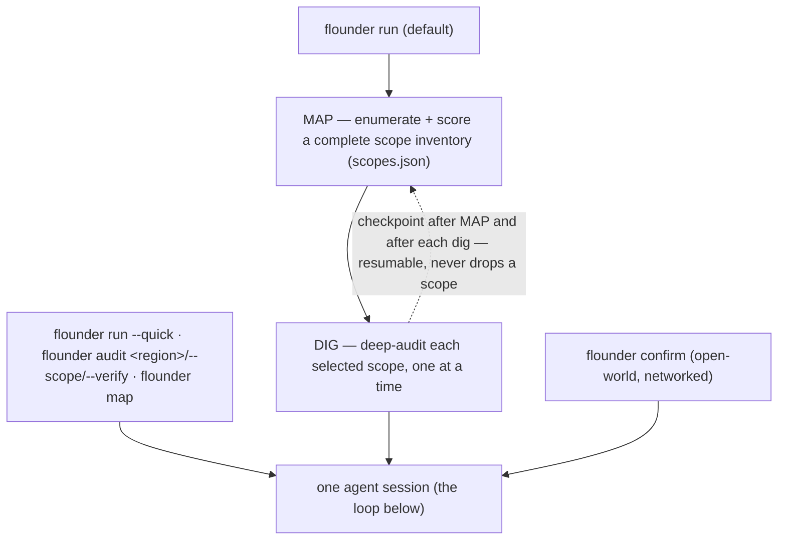
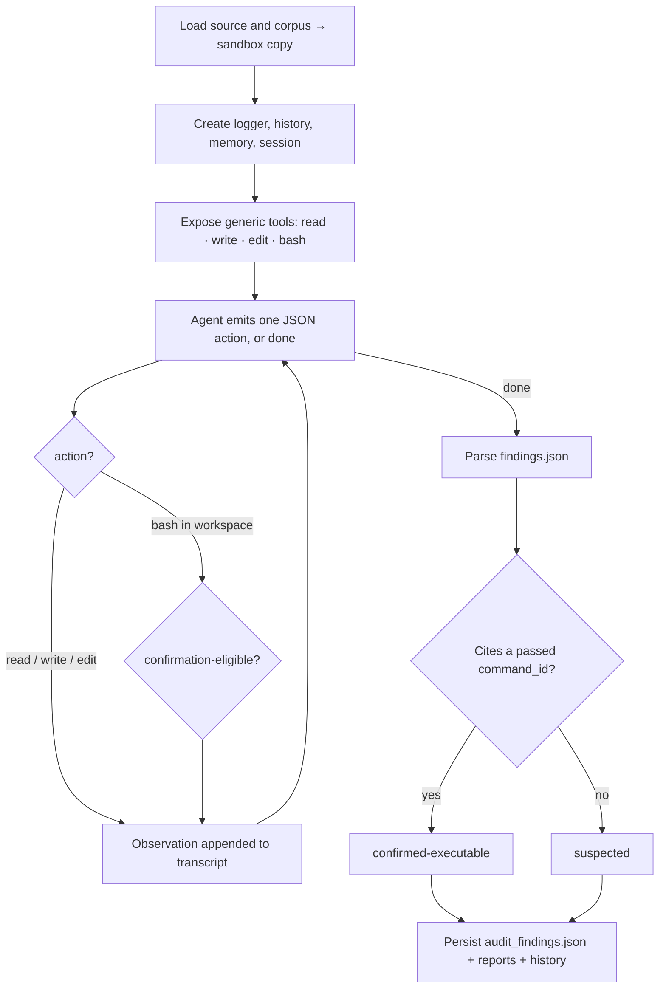

# Using Flounder

Practical guide to driving Flounder from the CLI, the dashboard, the API, and the library. For the design and internals, see [ARCHITECTURE.md](ARCHITECTURE.md). For the lean overview, see the [README](../README.md).

One command; the model decides what to read, test, and report. The flags shape *what* it audits and *how thoroughly* — never *what the bug is*.

## Agentic flow

`flounder run` orchestrates a **map → dig** pass; each phase — and each other verb — runs the *same* thin agent session. The default `flounder run` is map→dig; `flounder run --quick`, `flounder audit`, and `flounder map` enter that one session directly, and `flounder confirm` runs it open-world.



Each session is the thin loop:



### Tools

The tool surface is intentionally small:

- `read`: read loaded source/corpus or files created in the sandbox.
- `write`: write a file into the copied sandbox workspace.
- `edit`: replace text in a file inside the copied sandbox workspace.
- `bash`: run one policy-gated local inspection or test command in the copied workspace.

There are no default bug-class, dataflow, checklist, memory, or report tools. If those are useful later, they should be optional extensions or materials the model can choose to inspect, not framework-owned strategy.

### Confirmation

Findings use two base statuses:

- `suspected`: the agent reported a candidate without a passing cited local test.
- `confirmed-executable`: the agent wrote `findings.json` with a `command_id` that cites a confirmation-eligible `bash` record.

The framework checks the recorded command result. The model cannot upgrade a finding by assertion. Local execution must stay local: unit tests, fixtures, regtest/devnet, forked local nodes, or isolated harnesses only.

## Install

```bash
npm install
npm run build
npm test
npm run sandbox:build  # optional, but required for default OCI execution
```

For live model runs, configure provider credentials in your shell or secret manager according to the pi-ai provider documentation. Do not commit credentials, local environment files, private corpora, or machine-specific paths.

## Execution Sandbox

Model-generated commands run in a copied workspace through `src/security/sandbox.ts`. The default backend is `auto`: Flounder runs commands in the OCI image `flounder-sandbox:latest` when that image is available, and otherwise refuses to execute on the host. Build the default image with:

```bash
npm run sandbox:build
```

Use `--sandbox-image <image>` to provide a target-specific image with extra toolchains. Use `--sandbox-backend oci` to require OCI, or `--sandbox-backend host --allow-host-execution` only for trusted local smoke tests and fixtures. Host execution keeps the isolated `HOME` and package-cache environment, but it cannot provide kernel-level network or filesystem isolation.

Network policy is phase-specific. Sealed `run` / `map` / `audit` inspection and confirmation commands use `--network none` in OCI. Dependency warm-up and explicit `purpose=build` commands default to `--prepare-network enabled` so package registries can be used. `flounder prepare` and `flounder confirm` default to `--confirm-network enabled` because they are the open-world phases; the command-safety policy still forbids broadcast, value-moving, destructive, credential, and persistence behavior.

## Materials

- `--source <paths...>` — the code under audit. Point it at the buildable project root (the directory holding the manifest/lockfile) so the agent can execution-confirm.
- `--build-root <dir>` — when `--source` is narrow inside a larger workspace, the build root the sandbox copies so the project compiles (the model still reads only `--source`). A buildable workspace is what separates `confirmed` from `suspected`.
- `--corpus <paths...>` — design **intent** the model reads to derive what the code MUST enforce: the project's real specs, whitepapers, design notes, prior audits, or a strictly factual incident brief. Corpus is context, never answers — it must not name the bug, its location, or its mechanism, and you should not author it yourself. Give the spec and let the model find the gap.

## Commands

The sealed verbs (`run` / `map` / `audit`) share the tools, the confirmation gate, and the network-sealed boundary; they differ only in what slice they cover. `confirm` is the open-world follow-up.

| Command | What it does |
|---|---|
| `flounder run` | **the default real audit** — map → audit in one pass: MAP enumerates and scores a complete scope inventory, then the dig deep-audits the highest-scored scopes obligation-by-obligation and execution-confirms. Resumable, never silently drops a scope. (`--quick` runs a single breadth pass instead.) |
| `flounder map` | enumerate + persist the scope inventory only (`audit_scopes.json`), no dig — inspect or curate scopes before auditing |
| `flounder audit <region>` | deep-audit one region you already care about (skip the map) |
| `flounder audit --scope <id,...>` | dig specific inventory items after a `flounder map` (the human-in-the-loop pick over the complete map) |
| `flounder audit --verify <findings.json>` | confirm-or-refute existing suspected findings by execution — the standalone confirmation step on a prior run's `audit_findings.json` |
| `flounder confirm <run-dir>` | open-world: reproduce a run's findings on the real target |

The sealed verbs are **unbounded by default** (a run ends when the model is done, not at a step count) — a fixed budget silently truncates a productive dig. Cap a phase only when you want to: `--map-steps` / `--dig-steps` (and `--max-steps` for `run --quick` / `audit <region>`). A killed run **resumes** (it skips MAP and the already-audited scopes), so longer unbounded runs are safe to interrupt.

## Most effective setup

For a real audit, run `flounder run` (map → audit) on a buildable target:

```bash
flounder run \
  --target protocol \
  --source ./contracts --build-root . \
  --corpus ./docs/specs \
  --provider openai-codex \
  --map-steps 60 --dig-steps 60 --dig-samples 2
```

- Set `--build-root` so the dig can execution-confirm — without it you only get `suspected` findings.
- Give generous budgets and **do not interrupt a dig**; a decisive obligation can surface late in its step budget.
- `--dig-samples K` unions K independent passes (variance reduction); `--dig-concurrency N` digs N scopes in parallel; `--remap` re-enumerates. Reliability comes from coverage and repetition, not prompt tuning.
- The codex provider (`openai-codex`) is the recommended autonomous path; it needs a one-time interactive `pi` `/login`.

## Confirmation ladder

`suspected` → `confirmed-executable` (a cited `purpose=confirm` test actually passed) → `confirmed-differential` (the model's fix, applied to pristine source, blocks the exploit). An independent refutation skeptic then re-judges every confirmation: a **vacuous** one — a PoC that only triggers by giving a trusted/pinned component behavior a real attacker cannot cause — is downgraded and flagged, never silently dropped. A downgraded finding gets one **appeal**: it rebuilds a faithful PoC answering the exact objection, and if that survives re-judgement the finding is recovered; the original confirmation, the refutation, and the appeal outcome are all kept (`--no-appeal` to skip). Build the PoC the way the attacker would — assume only capabilities a real attacker has, exercise the real components, and never grant yourself something the deployed system would deny.

## Examples

**Zcash — Rust ZK circuits (stack-agnostic, execution-confirmed).** Audit a circuit crate for a soundness gap: `--source` the crate, `--build-root` the cargo workspace, `--corpus` the circuit's design spec. `flounder run` makes MAP enumerate the circuit's constraints — including operands the spec treats as given, a classic under-constrained-witness bug — and the dig write a `MockProver` malicious-witness test. A real crate-internal soundness bug reached `confirmed-differential` this way (the model wrote the exploit, the framework built and ran it, then applied the model's fix and re-ran to show it blocked). A subtle one needs `flounder audit --scope <id>` + `--dig-samples` and an uninterrupted dig.

**Aztec — Solidity rollup (incident analysis and cold audit).** Two scenarios on the deployed `RollupProcessorV3`:

- *Incident analysis* — give the agent the real deployed contracts (`--source`/`--build-root` on the Foundry project), the official Aztec specs, and a strictly factual on-chain incident brief (`--corpus`); nothing you authored, no hand-picked scope. Let it localize, then `flounder audit --verify` (or the dig) confirms by execution.
- *Cold audit* — the same materials **minus** the incident brief. From scratch, `flounder run` independently flagged the decode/settlement region and reached `confirmed-differential` on an unbound-input bug (`numRealTransactions` not bound to the verifier's public-input hash), with a faithful proof-of-malleability PoC — with no knowledge that an incident had ever occurred.

## Local checks

```bash
npm run mock-audit     # offline smoke test with the deterministic mock model
npm run check:public  # public-surface scan for secrets and local paths
npm run verify        # full local verification gate
```

## Confirm — open-world reproduction

`flounder confirm <run-dir> --source <paths...>` takes a finished `flounder run` to a real-world standard of certainty and writes a submit/no-submit decision sheet. It is the open-world counterpart to the sealed `run`, and the only capability difference is that the network is available.

Confirm is **finding-grained and resumable**: each finding gets a real-target outcome (`reproduced` / `not-reproduced`), and a re-run skips the ones already decided. The CLI form confirms a whole run dir; from the dashboard you can **Confirm** a single finding or all pending findings of a project (it reproduces only what's still undecided — including findings added by a later `Continue audit`).

```bash
flounder confirm ./runs/protocol-<timestamp> \
  --source ./contracts --build-root . \
  --provider openai-codex
```

What it does, in one session:

1. **Freeze + fingerprint** the run's findings (sha256 + timestamp) *before* any network access — anchoring the "found blind, no network" provenance.
2. **Reproduce** each finding against **real ground truth** — the model decides what that is for the target (a mainnet fork of the deployed contract and its real verifier, a real released package, a local node) and writes the reproduction itself. A finding is marked `reproduced` only if it triggers on the real target, using only attacker-real capabilities, with the effect **exhibited** as a concrete observable (a drained balance, a forged output, an accepted invalid input) — never a printed string, never an argument.
3. **Consolidate** by execution: a fix-equivalence matrix cross-applies each bug's fix against the others' PoCs and merges any a single fix neutralizes — *distinct bugs decided by execution, not by similar titles*.
4. **Check novelty** online (advisories, issues, post-mortems) — used only as a *lead* and as a *disqualifier* for already-disclosed bugs, never as proof.
5. **Decide**: `confirm_decision.json` + `confirm_report.md`, one row per distinct bug — reproduced?, evidence, novelty/corroboration, and a `submit-candidate` / `needs-human` / `drop` recommendation.

The three rules the prompt enforces: **execution is the only truth**; **the web is a lead, never proof**; **only attacker-real capabilities** (the same faithful-PoC rule the `run` refutation applies). A finding that only reproduced under a substituted trusted component, an unreachable precondition, or assumed state does **not** clear the bar — it is recorded `not-reproduced` with the exact crutch named.

`flounder confirm` is **unbounded by default** (reproduction is heavy; it ends when the model is done); pass `--max-steps N` to cap it. It needs a pi-session provider (e.g. `openai-codex`) — the mock/CLI fallbacks cannot fork a live network. It **auto-resumes** an interrupted prior confirm of the same run dir: it carries the already-settled rows forward and reproduces only the rest, checkpointing the decision sheet each turn so a kill loses no finished work (`--fresh` starts over).

**White-hat for the open world:** confirm may **fork and read** live networks/data to reproduce locally, but it must **never broadcast** a transaction to a non-local network, move funds, or write to any live system. Replay the exploit against a *local* fork; never push it to the live one (`src/security/policy.ts`).

> Validated end-to-end: pointed at a prior `run`'s Aztec findings, `flounder confirm` reproduced the real `numRealTransactions` accounting bug on a mainnet fork (real proxy + real verifier, flipping one attacker-controllable byte) and execution-*refuted* the findings that only worked against a mocked verifier/proxy — zero false reproductions.

### Reproduction inside a run

Inside `flounder run`, reproduction is part of the audit itself: the agent calls `bash` to write and run local tests in the copied workspace, and a finding only reaches `confirmed-executable` when a `purpose=confirm` test passes. The agent writes files only inside a copied workspace under the run directory; it never modifies the target source tree. Command safety blocks public-network broadcast, transfer, credential, persistence, and exploit-optimization flows.

## Domain profiles

Config files under `configs/` can provide source paths, corpus paths, project context, and optional domain hints. In audit mode these are context, not a framework-owned checklist. They are **opt-in and off by default** — a plain `flounder run` carries no preset bug knowledge; pass `--config` only when you want to seed a known vulnerability class. See [configs/README.md](../configs/README.md) for when to use them and the line a profile must not cross.

```bash
flounder run \
  --config ./configs/solidity-contract-audit.default.json \
  --target contract-audit \
  --source <contract-source-paths...> \
  --corpus <specs-docs-and-prior-audit-material...> \
  --provider openai --model gpt-5.5
```

Stack-specific guidance: [SOLIDITY.md](SOLIDITY.md) and [STARKNET.md](STARKNET.md).

## Pi package

Try the package locally from this directory:

```bash
pi -e flounder-scanner
```

The extension registers two tools — `flounder_run` (the sealed map→dig audit) and `flounder_confirm` (the open-world reproduction of a finished run's findings) — and installs the shared command-safety guardrail for shell commands. They mirror the `flounder run` / `flounder confirm` CLI verbs so a pi agent can orchestrate audit→confirm.

## Outputs

Each audit writes:

- `audit_transcript.json`: replayable action/observation trace.
- `audit_findings.json`: raw agent-reported findings.
- `audit_command_runs.json`: local sandbox command records.
- `summary.json`: ranked finding summary and coverage.
- `report_<id>.md`: private disclosure drafts.
- `events.jsonl` and `calls/*.json`: audit trace and model-call records.
- `<out>/history/<target>/memory.jsonl`: durable per-target memory.
- `<out>/history/<target>/manifest.json`: project-level history.

Each `flounder confirm` writes:

- `confirm_provenance.json`: sha256 + timestamp of the run findings, frozen before any network access.
- `confirm_decision.json`: the decision sheet — one row per distinct bug (reproduced?, evidence, novelty, recommendation).
- `confirm_report.md`: the human-readable decision sheet.
- `confirm_equivalence.json`: the fix-equivalence matrix (which fixes block which PoCs) and the resulting clusters.
- `confirm_transcript.json`, `events.jsonl`, `calls/*.json`: the open-world session trace.

Run artifacts are private by default. Redact before sharing outside the trusted project context.

### Tracking store

Every run records its metadata to a SQLite store at `<out>/flounder.db` (via `node:sqlite`, no extra dependency): the project, the run lifecycle, scope coverage (mapped vs audited, updated live), findings and their status transitions (suspect → confirm → refute, on a timeline), and confirm decisions. It holds metadata and **paths** to the on-disk artifacts above, not their content. Inspect it across all projects without reading run dirs:

```bash
flounder db projects                 # every project: scope coverage, finding counts, latest run
flounder db runs <target>            # run history for a project
flounder db findings <target>        # findings with their status timeline
flounder db daemons                  # registered execution daemons
flounder db mint-token [name]        # mint a bearer token for a remote daemon
```

This is the backend the dashboard reads from; it is written live by each run (not rebuilt from files).

## Dashboard

```bash
flounder ui                 # dashboard at http://127.0.0.1:4500 + a co-located executor daemon
flounder ui --no-daemon     # control plane only — connect your own daemon(s) elsewhere
flounder daemon --server http://<server>:4500 --token <token>   # run the executor on another machine
```

A web dashboard to track and drive audits across projects, updating live via SSE. A project's detail is the **prepare → map → dig → confirm** pipeline: it auto-follows the running phase, each phase shows its elapsed time, and the scope being dug is marked `auditing`. Below it — a scored **scope queue** you can hand-order (**↑ Top** pushes a scope to the front of the dig, separate from its score) and skip/resume; **findings that stream in as each scope lands** and change status through refutation, each with a per-finding **Confirm** button and its real-target outcome (reproduced / not-reproduced); a project-wide **Confirm pending on real target** (reproduces every still-undecided finding; a re-run only does what's still pending); and viewable Markdown **reports**. **Start/Continue** an audit (resume), **Restart** (re-map), **Run…**, or stop a running run. A separate **Bugs** tab is a cross-project board of every finding with submission tracking. Behind the gear: **provider profiles** (the **vendor** only — model & thinking are chosen **per phase** in each project's config, from the vendor's live model list) and **daemon** CRUD (mint a token, rename, revoke).

Execution is **decoupled** from the dashboard: the `flounder ui` server is a **control plane** (REST API + SQLite + a job queue) and the audit runs on a **daemon**, so the target code and provider keys stay on the daemon's machine. `flounder ui` spawns a co-located daemon by default (rooted at `--workspace`, default `./workspace`); pass `--no-daemon` and run `flounder daemon` elsewhere (with a token from `flounder db mint-token`) to execute on a different host. A project's materials are paths **relative to** its directory under the daemon's workspace, so nothing leaks an absolute path. The server binds to `127.0.0.1` by default; the daemon protocol is bearer-token-authenticated.

### HTTP API (agent-drivable)

The UI is just one client of a REST API the `flounder ui` server exposes. **Every** operation the UI performs is an API call, so an agent can drive the whole workflow without the UI. The API is **self-describing**: `GET /api` returns a catalog of every resource and endpoint (method, path, params, body) — an agent fetches it once to learn the surface, then calls it. (The machine-to-machine `/api/daemon/*` protocol the executor uses is bearer-authenticated and omitted from the catalog.)

```bash
curl localhost:4500/api                                   # catalog of every endpoint
curl -X POST localhost:4500/api/projects -d '{"name":"p","providerId":1,"dir":"p"}'
curl -X POST localhost:4500/api/projects/p/runs -d '{"verb":"run"}'   # enqueue a run for a daemon
curl localhost:4500/api/projects/p                        # progress, counts, runs, confirm decisions
curl 'localhost:4500/api/projects/p/findings?status=confirmed-differential'
curl 'localhost:4500/api/projects/p/confirm-decisions?reproduced=yes'  # the confirmed bugs
```

Resources: **project** (CRUD), **provider** (vendor profiles), **daemon** (CRUD — mint/rename/revoke), **run** (`POST /api/projects/:name/runs` enqueues a job a daemon claims; `GET /api/runs/:id`; `POST /api/runs/:id/stop`; `GET /api/runs/:id/artifact?name=` reads a report file), and read-only **scope** / **finding** / **confirm-decision** (paginated + filterable). Operator actions: `PATCH …/scopes/:id {prioritize:true}` reorders the dig queue; `PATCH /api/findings/:id/tracking` advances a finding's submission state; a confirm `POST …/runs {verb:"confirm"}` reproduces all pending findings (or one, with `findingId`). `GET /api/bugs` is a cross-project finding+tracking view. `GET /api/stream` is an SSE feed for live updates; `GET /api/runs/:id/log` streams a run's live token-level activity, fed by the executing daemon.

## Library API

```ts
import { defaultConfig, runAudit, MockAuditLlmClient } from "flounder-scanner";

const cfg = defaultConfig();
cfg.targetName = "example";
cfg.sourcePaths = ["./fixtures"];

const result = await runAudit(cfg, { llm: new MockAuditLlmClient() });
console.log(result.runDir);
```

Use `flounder-scanner/pi/extension` for the pi package extension entrypoint.
